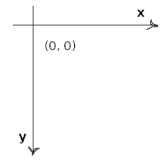
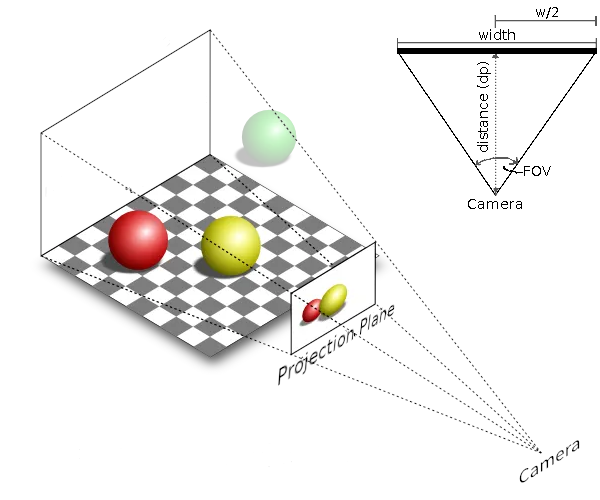
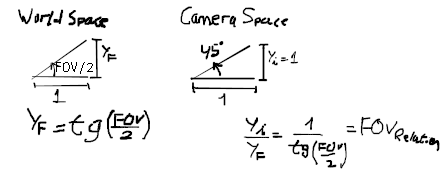
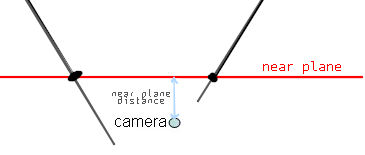
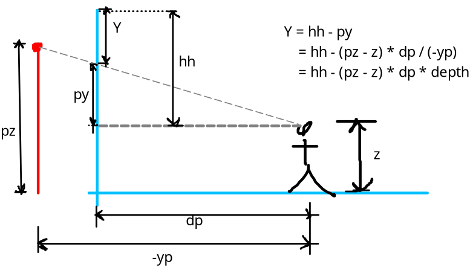
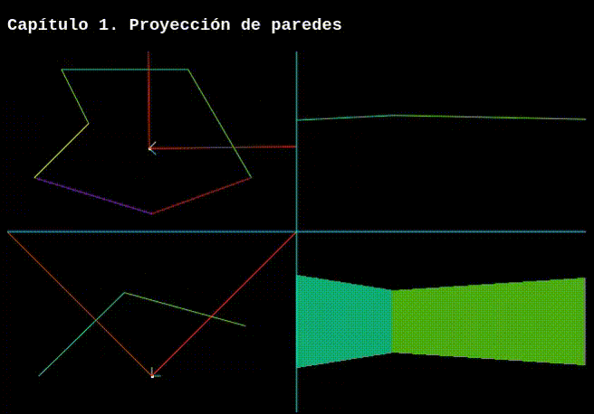

# **Capítulo 2.** Proyección de Paredes
 
Para empezar a comprender las técnicas de renderización comenzaremos con un ejemplo básico, dibujaremos paredes 2D con perspectiva 3D vistas desde una primera persona. Esta técnica tiene sus limitaciones, las paredes siempre van a estar a 90° con respecto al suelo. En los sucesivos capítulos iremos agregando características al motor.

## Definiciones
Para comenzar, definimos el sistema de coordenadas a utilizar.



Todas las distancias están medidas en **metros**.\
Antes de profundizar en el algoritmo es necesario definir algunos conceptos.
### World
El mapa (*World*) es un conjunto de **Sectores** (*Sector*). Se puede interpretar a un Sector como un área o un ambiente y está conformado por un conjunto de **Segmentos** (*Segment*). Un Segment es una línea recta definida entre dos **Puntos** (*Point*). Por último, un Point no es más que una coordenada 2D (x, y) en el **World Space**.
```javascript
/* --- Segment.js --- */
const Point = (x, y) => ({
    x, y, // World Coordinates
})
    
const Segment = (x0, y0, x1, y1) => ({
    p0: Point(x0, y0), // Initial Point
    p1: Point(x1, y1),  // End Point

    color: `hsl(${~~(Math.random() * 360) % 360}, 80%, 50%)`,
})
```

```javascript
/* --- Sector.js --- */
const Sector = () => ({
    segments: []
})
```
### Pantalla y Lienzo
En cuanto al espacio de renderización, es decir, el área de dibujo, debemos definir dos términos: la **Pantalla** (*Screen*) y el **Lienzo** (*Canvas*).\
La Screen va a contener todos los píxeles de la proyección 3D que realizaremos desde el punto de vista del jugador. Adicionalmente, establece la resolución de renderización que en principio será de 320x200 que es la misma que tiene *Doom Vanilla*.\
Por otro lado, el Canvas hace referencia al elemento HTML en el cual se va a dibujar la Screen. Utilizaremos la interfaz CanvasRenderingContext2D del canvas, es decir que no emplearemos OpenGL.\
Sobre el Canvas vamos a dibujar 4 "vistas" de 320x200, es por ello que necesitamos una resolución que sea el doble de la Screen.
```javascript
/* --- Graphics.js --- */
const Screen = {
    width:  320, // px
    height: 200, // px
    ctx: null,   // Sobre este context vamos a dibujar lo que ve el jugador
}

const Canvas = {
    init(canvas) {
        // DOM Elements
        this.canvas = canvas
        this.buffer = document.createElement("canvas")
      
        // Resolutions
        const w = Screen.width  * 2
        const h = Screen.height * 2
		this.canvas.width  = w
        this.canvas.height = h
		canvas.style.width  = w + "px"
        canvas.style.height = h + "px"
        this.buffer.width  = Screen.width
		this.buffer.height = Screen.height
      
        // Contexts
        this.ctx   = this.canvas.getContext("2d")
        Screen.ctx = this.buffer.getContext("2d")
    },
  
  draw() {
      this.ctx.drawImage(this.buffer, Screen.width, Screen.height)
  }
}
```
### Cámara
La **cámara** (*Camera*) representa el punto de vista del jugador la cual se va a mover y rotar a medida que este lo haga. Todo aquel objeto que esté dentro del rango de visión de la cámara se proyectará sobre un plano 2D llamado **Plano de proyección** (*Projection Plane*). Este plano no es más que la Screen que definimos previamente.



La cámara posee varios atributos que son interesantes de analizar:

- **Posición:** Es un vector 3D que indica las coordenadas de la ubicación de la cámara en el mundo tridimensional.
- **FOV** (Field Of View): es un ángulo de apertura que determina cuánto es capaz de ver el usuario el mundo que tiene frente a él. A mayor FOV mayor cantidad de objetos a renderizar en pantalla.
- **Distancia al plano de proyección** (**dp**): esta distancia se puede obtener con la fórmula $dp = \frac{w / 2}{tan({FOV} / 2)}$ 
- **Dirección**: representada tanto por un ángulo de rotación en el eje Z (*angle*), como por un vector cuyas componentes son <cos(angle), sin(angle)>.

```javascript
/* --- Camera.js --- */
const v2 = (x, y) => ({x, y})
const v3 = (x, y, z) => ({x, y, z})

const Camera = {
    pos: v3(0, 0, 2), // En Z tiene 2 => 2 metros de separación del suelo
    dir: v2(0, 0),
  
    setAngle(angle) {
        this.angle = angle
        this.dir.x = Math.cos(angle)
        this.dir.y = Math.sin(angle)
    },
  
    setFOV(FOV) {
        this.FOV = FOV
        this.tanFOV = Math.tan(FOV / 2)
        this.FOVRelation = 1 / this.tanFOV
        this.dp = (Screen.width / 2) / this.tanFOV
    }
}
```
## Algoritmo
Una vez definidas las primeras clases a utilizar a continuación pasaremos a dibujar algo en pantalla. Primero la estructura básica del HTML `index.html`:
```html
<!DOCTYPE html>
<html>
    <head>
        <meta charset="utf-8">
        <title>Capítulo 2. Proyección de paredes</title>

        <!-- JavaScript Files -->
        <script src="Graphics.js"></script>
        <script src="Segment.js"></script>
        <script src="Sector.js"></script>
        <script src="Camera.js"></script>
        <script src="Controls.js"></script>
        
    </head>
    <body style="background: black; color: white; font-family: courier">
        <h3>Capítulo 1. Proyección de paredes</h3>
        <canvas id="canvas" style="image-rendering: pixelated;"></canvas><br>
        <label>
            FOV
            <input type="range"  min="10" max="180" value="90" id="FOVRange">
            <span id="FOVValue">90</span>
        </label>
        <script src="main.js"></script>
    </body>
</html>
```
El *input range* controla el FOV de la cámara. Con este instrumento, el usuario puede formar una idea intuitiva de cómo afecta este parámetro a la renderización.\
Para controlar los movimientos de la cámara, añadimos un nuevo archivo `Controls.js`:
```javascript
const Controls = {
    // Teclas presionadas
    inkey: {
        KeyW:0, KeyS:0,
        KeyA:0, KeyD:0, 
    },
    
    // El init anexiona los Eventos relacionados con la pulsación de teclas
    init() {
        document.addEventListener("keydown", e => {this.inkey[e.code] = true})
        document.addEventListener("keyup",   e => {this.inkey[e.code] = false})
    },
    
    // Update actualiza el movimiento y la dirección de la Camera
    update (deltaTime) {
        const moveSpeed = deltaTime * 2.5 * (this.inkey.KeyW - this.inkey.KeyS),
          rotationSpeed = deltaTime * 1.5 * (this.inkey.KeyD - this.inkey.KeyA);
        Camera.pos.x += Camera.dir.x * moveSpeed
        Camera.pos.y += Camera.dir.y * moveSpeed
        Camera.setAngle(Camera.angle + rotationSpeed)
    }
}
```
Con `W` y con `S` la cámara avanza o retrocede. Con `A` y con `D` la cámara rota.\
En el archivo `main.js` inicializamos todos los componentes y creamos el mundo. Para el mapa definimos una serie de segmentos que describen un polígono. Es importante notar que están definidos siguiendo una orientación horaria (*clockwise*). Vamos a seguir un esquema donde un Segment será visible solo si el jugador está a su derecha.
```javascript
// Iniciamos la Camera
Camera.setAngle(0)
Camera.setFOV(Math.PI / 2) // 90°
Camera.pos.x = 13
Camera.pos.y = 13


// Iniciamos el Canvas
Canvas.init(document.getElementById("canvas"))

// Iniciamos los Controles
Controls.init()

// Iniciamos un "Mapa Sencillo"
const mainSector = Sector()
mainSector.segments.push(
    //      x0  y0  x1  y1
    Segment( 6,  2, 20,  2),
    Segment(20,  2, 27, 14),
    Segment(27, 14, 16, 18),
    Segment(16, 18,  3, 14),
    Segment( 3, 14,  9,  8),
    Segment( 9,  8,  6,  2)
)

// Controlamos el Range para el FOV
const range = document.getElementById("FOVRange")
range.addEventListener("input", () => {
    Camera.setFOV(range.value * Math.PI / 180)
    document.getElementById("FOVValue").innerText = range.value + "°"
});
```
### Vistas
Para entender las distintas proyecciones que van sufriendo los segments hasta aparecer en pantalla vamos a dibujar 4 "vistas": **World Space**, **Camera Space**, **Frustum Culling** y **Screen Space**. Para ayudarnos a organizar creamos un nuevo archivo: `Views.js`.
```javascript
const Views = {
    scale: 10,
    init () {
        this.canvas = document.createElement("canvas")
        this.ctx = this.canvas.getContext("2d")
        this.canvas.width  = Screen.width
        this.canvas.height = Screen.height
    },

    clean() {
        this.ctx.fillStyle = "black"
        this.ctx.fillRect(0, 0, Screen.width, Screen.height)
        Screen.ctx.fillStyle = "black"
        Screen.ctx.fillRect(0, 0, Screen.width, Screen.height)
    },

    worldSpace() {
        this.clean()
        const ctx = this.ctx
        ...
    },
      
    cameraSpace() {
        this.clean()
        const ctx = this.ctx
        ...
    },
      
    depthSpace() {
        this.clean()
        const ctx = this.ctx
        ...
    },

    screenSpace() {
        this.clean()
        const ctx = Screen.ctx
        ...
    }
}
```
Lo importamos en nuestro HTML:
```html
...
        <!-- JavaScript Files -->
        . . .
        <script src="Controls.js"></script>
        <script src="Views.js"></script>
...
```
Por último, modificamos el Canvas en nuestro  `Graphics.js`:
```javascript
const Canvas = {
    init(canvas) {
        . . .
        Views.init()
    },

    drawLimits() {
        this.ctx.strokeStyle = "#0ff"
        this.ctx.beginPath()
            this.ctx.moveTo(Screen.width, 0)
            this.ctx.lineTo(Screen.width, this.h)
            this.ctx.moveTo(0, Screen.height)
            this.ctx.lineTo(this.w, Screen.height)
        this.ctx.stroke()
    },

    draw() {
        // World Space
        Views.worldSpace()
        this.ctx.drawImage(Views.canvas, 0, 0)

        // Camera Space
        Views.cameraSpace()
        this.ctx.drawImage(Views.canvas, Screen.width, 0)

        // Depth Space
        Views.depthSpace()
        this.ctx.drawImage(Views.canvas, 0, Screen.height)

        // Screen Space
        Views.screenSpace()
        this.ctx.drawImage(this.buffer, Screen.width, Screen.height)

        this.drawLimits()
    }
}
```
### World Space
La primera vista el *World Space*, donde se grafican estáticamente los segmentos previamente definidos y la posición y orientación global de la cámara.
```javascript
const Views = {
    ...
    worldSpace() {
        this.clean()
        const ctx = this.ctx
        const l = this.scale

       // Dibujar segmento por segmento
        for (const s of mainSector.segments) {
            ctx.strokeStyle = s.color
            ctx.beginPath()
                ctx.moveTo(s.p0.x * l, s.p0.y * l)
                ctx.lineTo(s.p1.x * l, s.p1.y * l)
            ctx.stroke()
        }

         // Dibuja la cámara con una línea indicando la dirección
        const px = Camera.pos.x * l,
              py = Camera.pos.y * l;
        // Eje i
        ctx.strokeStyle = "#ddd"
        ctx.beginPath()
            ctx.moveTo(px, py)
            ctx.lineTo(px + Camera.dir.x * 10, py + Camera.dir.y * 10)
        ctx.stroke()
        // Eje j
        ctx.strokeStyle = "#0dd"
        ctx.beginPath()
            ctx.moveTo(px, py)
            ctx.lineTo(px - Camera.dir.y * 10, py + Camera.dir.x * 10)
        ctx.stroke()
        // Centro de la cámara
        ctx.fillStyle = "#fff"
        ctx.fillRect(px - 1, py - 1, 3, 3)

        // Dibuja los límites del FOV
        ctx.strokeStyle = "#e30"
        ctx.beginPath()
            ctx.moveTo(px, py)
            ctx.lineTo(px + Math.cos(Camera.angle - Camera.FOV * .5) * 1000, py + Math.sin(Camera.angle - Camera.FOV * .5) * 1000)
            ctx.moveTo(px, py)
            ctx.lineTo(px + Math.cos(Camera.angle + Camera.FOV * .5) * 1000, py + Math.sin(Camera.angle + Camera.FOV * .5) * 1000)
        ctx.stroke()
    },
    ...
}
```
### Camera Space
Transformación de World Space a Camera Space: **Traslación** y luego **Rotación**.\
Traslación: pos' = pos - Camera.pos\
Rotación: por medio de la matriz de rotación:

$$R = 
 \begin{bmatrix}
  -dir_Y & dir_X \\
  -dir_X & -dir_Y
 \end{bmatrix}$$
 
Ahora empleando: $R \cdot [v]_B = [v]_B'$

$$X' = -dir_Y*X + dir_X*Y$$

$$Y' = -dir_X*X - dir_Y*Y$$

Agregamos funcionalidad a `Point`:
```javascript
const Point = (x, y) => ({
    x, y, // World Coordinates

    toCameraSpace() {
        const xd = this.x - Camera.pos.x,
			  yd = this.y - Camera.pos.y;
		this.xp = (-xd * Camera.dir.y + yd * Camera.dir.x) * Camera.FOVRelation
		this.yp =  -xd * Camera.dir.x - yd * Camera.dir.y
    }
})
```
A `xp` se lo multiplica por `Camera.FOVRelation` para aplicar el efecto del FOV a la transformación. Derivación:



Y a `Segment`:
```javascript
const Segment = (x0, y0, x1, y1) => ({
    . . .
    toCameraSpace() {
        this.p0.toCameraSpace()
        this.p1.toCameraSpace()
    }
})
```
En `Sector` incorporamos una función que proyecte cada Segment en el Camera Space.
```javascript
const Sector = () => ({
    . . .
    project() {
        for (const s of this.segments)
            s.toCameraSpace()
    }
})
```
En `main` vamos a llamar al *project* del sector principal antes de enviar a dibujar:
```javascript
// Main Loop
(function update(time) {
    . . .
    mainSector.project()
    Canvas.draw()
    . . .
})(0)
```
Y podemos dibujar la vista en `Views`:
```javascript
const Views = {
    . . .
    cameraSpace() {
        this.clean()
        const ctx = this.ctx
        const l = this.scale
        const px = Screen.width  / 2
        const py = Screen.height / 2 + 60

        // Dibujar segmento por segmento
        for (const s of mainSector.segments) {
            ctx.strokeStyle = s.color
            ctx.beginPath()
                ctx.moveTo(s.p0.xp * l + px, s.p0.yp * l + py)
                ctx.lineTo(s.p1.xp * l + px, s.p1.yp * l + py)
            ctx.stroke()
        }

        // Dibuja la cámara con una línea indicando la dirección
        // Eje i'
        ctx.strokeStyle = "#ddd"
        ctx.beginPath()
            ctx.moveTo(px, py)
            ctx.lineTo(px, py - 10)
        ctx.stroke()
        // Eje j'
        ctx.strokeStyle = "#0dd"
        ctx.beginPath()
            ctx.moveTo(px, py)
            ctx.lineTo(px + 10, py)
        ctx.stroke()
        // Centro de la cámara
        ctx.fillStyle = "#fff"
        ctx.fillRect(px - 1, py - 1, 3, 3)

        // Dibuja los límites del FOV
        ctx.strokeStyle = "#e30"
        ctx.beginPath()
            ctx.moveTo(px, py)
            ctx.lineTo(px - 1000, py + 1000)
            ctx.moveTo(px, py)
            ctx.lineTo(px + 1000, py + 1000)
        ctx.stroke()
    },
    . . .
}
```
### Depth Space
El siguiente espacio de transformación es el **Depth Space**. Las coordenadas tienen por nombre: *col* (de columna) y *depth* (relativo a la profundidad).
#### Columna
Empezamos por obtener la columna. La idea es deformar el "triángulo" que forma el FOV en un rectángulo, tal que el extremo izquierdo del FOV coincida con la columna 0, y que el extremo derecho del FOV coincida con el ancho de la pantalla. Expresado matemáticamente: deseamos que todo punto perteneciente a la recta y=-x sea col=0. Todo punto de la recta y=x sea col = width. Y que todo punto de x=0 sea col = width/2 (mitad de la pantalla).\
Queremos:

| x=-y → col=0 |  x=0 → col = w/2 | x=y→ col=w
| ----------- | ----------- | ----------- |

Aplicando la transformación: col = xp / yp

| x=-y → col=-1 | x=0 → col = 0 | x=y→ col=1 |
| ----------- | ----------- | ----------- |

Aplicando una nueva transformación: col' = w / 2 * (col + 1). Obtenemos finalmente:

| x=-y → col=0 |  x=0 → col = w/2 | x=y→ col=w
| ----------- | ----------- | ----------- |

Entonces: col = w / 2 * (1 + xp / yp)
#### Depth
La siguiente coordenada es una valor que representa qué tan alejado está el punto de la cámara. Viendo el Camera Space, mientras más negativo sea el *yp* más alejado está el punto e ignoramos el *xp* para este cálculo. Entonces se define simplemente:\
depth = -1 / yp\
Puede resultar arbitrario que sea un cociente, pero más adelante va a entender los beneficios de definir la coordenada de esta forma y no simplemente depth = -yp.

Agregamos la nueva proyección a `Point`:
```javascript
const Point = (x, y) => ({
    . . .
    toDepthSpace() {
        this.col = Screen.width * .5 * ~~(1 + this.xp / this.yp)
        this.depth = - 1 / this.yp
    }
})
```
El operador `~~` en JavaScript, es una doble *bitwise not* binario. Es un truco simple para redondear hacia abajo y evitar usar `Math.floor`.
#### Frustum Culling
Antes de poder proyectar los puntos de un segment al Depth Space es importante entender el **Frustum Culling**. Vea que las coordenadas col y depth deben dividir por *yp* para obtener el valor. Esto nos genera la restricción de que *yp* no puede valer 0. Para evitar que esto nos ocurra, debemos "cortar" el segment en el Camera Space si está muy cerca de la cámara. Entonces definimos el *Near Plane* como un plano perpendicular a la dirección de la cámara y se encuentra a poca distancia de la misma:



Agregamos la propiedad a la `Camera`:
```javascript
const Camera = {
	. . .
	nearPlane: -0.001,
    . . .
}
```
El near plane culling consiste en fijar el valor de yp en *nearPlane* y calcular xp con una regla de tres.\
Agregamos el método *toDepthSpace* en`Segment` y un método auxiliar que nos retorna la depth de una columna en particular empleando una interpolación lineal.
```javascript
const Segment = (x0, y0, x1, y1) => ({
    . . .
    // Retorna true si el Segment es visible
    toDepthSpace() {
        this.toCameraSpace()
		const xp0 = this.p0.xp, yp0 = this.p0.yp,
			  xp1 = this.p1.xp, yp1 = this.p1.yp;

		/* Near Plane Culling */
		if (yp0 > Camera.nearPlane) {
			if (yp1 > Camera.nearPlane) return false // El segment está detrás del Near Plane
			const dy = (Camera.nearPlane - yp0) / (yp1 - yp0)
			this.p0.xp += (xp1 - xp0) * dy
			this.p0.yp = Camera.nearPlane
		} else if (yp1 > Camera.nearPlane) {
			const dy = (Camera.nearPlane - yp1) / (yp0 - yp1)
			this.p1.xp += (xp0 - xp1) * dy
			this.p1.yp = Camera.nearPlane
		}

		this.p0.toDepthSpace()
        this.p1.toDepthSpace()
  
        // Verifica si el segment proyectado está dentro de los límites de la pantalla y el mismo esté orientado hacia la cámara
        return (this.p0.col < Screen.width) &&
               (this.p1.col >= 0) &&
               (this.p0.col < this.p1.col)
	},
      
    getDepthAt(col) {
        return (this.p1.depth - this.p0.depth) * (col - this.p0.col) / (this.p1.col - this.p0.col) + this.p0.depth
    }
})
```
Y en `Sector` debemos almacenar en una estructura adicional, aquellos segments que son visibles.
```javascript
const Sector = () => ({
    segments: [],
    visibles: [],

    project() {
        this.visibles.length = 0 // Limpio el arreglo auxiliar
        for (const s of this.segments)
            if (s.toDepthSpace()) { // Si es visible
                this.visibles[this.visibles.length] = s // Coloca a s en el último lugar
            }
    }
})
```
Ahora en `Views` solo debemos dibujar aquellos segments que son visibles.\
Por último, agregamos la función *depthSpace* en `Views`
```javascript
const Views = {
    . . .
    cameraSpace() {
        . . . 
        for (const s of mainSector.visibles) { // Solo dibujamos los visibles
            . . .
        }
        . . .
    },
      
    depthSpace() {
        this.clean()
        const ctx = this.ctx
        const l = 100
        const offset = 60

        // Dibujar segmento por segmento
        for (const s of mainSector.visibles) {
            ctx.strokeStyle = s.color
            ctx.beginPath()
                ctx.moveTo(s.p0.col, s.p0.depth * l + offset)
                ctx.lineTo(s.p1.col, s.p1.depth * l + offset)
            ctx.stroke()
        }
    },
```
### Screen Space
Llegamos a la parte final de este capítulo, donde dibujaremos efectivamente lo que ve la cámara.
#### Proyección
Con el Depth Space conseguimos la columna a la que pertenece el Punto, aún nos queda saber la posición Y en pantalla. La siguiente figura ilustra el problema.



Siendo `hh` la mitad de la altura de la pantalla. `pz` es el valor de la coordenada z del punto. `z` corresponde a la cámara. `dp` es la distancia al plano de proyección (se calculó en una sección anterior). `-yp` es el valor de la coordenada del Camera Space. `py` es la proyección del punto en la pantalla.\
Entonces simplemente $Y = hh - py$\
Por relación de triángulos $\frac {py} {dp} = \frac {pz - z} {-yp}$. Despejamos `py` y recordando que $depth = \frac{1}{-yp}$, entonces podemos obtener la componente `Y`:
$$Y = hh - (pz - z) \cdot dp \cdot depth$$
Como se puede ver, no hay ninguna división que puede llegar a ser costosa. Este es el beneficio de difinir a depth de esa forma.\
En nuestro programa necesitamos proyectar el extremo superior de un segmento (*top*) y el extremo inferior (*bottom*).\
Agregamos la proyección a Screen Space a `Point` y `Segment`. Adicionalmente, en `Segment` necesitamos dos funciones auxiliares que nos retornen el valor de top y bottom dada un columna, mediante una interpolación lineal
```javascript
const Point = (x, y) => ({
    . . .
    toScreenSpace(topZ, bottomZ) {
        this.top    = Screen.height * .5 - (topZ    - Camera.pos.z) * Camera.dp * this.depth
        this.bottom = Screen.height * .5 - (bottomZ - Camera.pos.z) * Camera.dp * this.depth
    }
})

const Segment = (x0, y0, x1, y1) => ({
    . . .
    toScreenSpace(topZ, bottomZ) {
        this.p0.toScreenSpace(topZ, bottomZ)
        this.p1.toScreenSpace(topZ, bottomZ)
    },
      
    getTopAt(col) {
        return (this.p1.top - this.p0.top) * (col - this.p0.col) / (this.p1.col - this.p0.col) + this.p0.top
    },

    getBottomAt(col) {
        return (this.p1.bottom - this.p0.bottom) * (col - this.p0.col) / (this.p1.col - this.p0.col) + this.p0.bottom
    }
   . . .
})
```
En `Sector` agregamos dos variables que nos indican la altura del techo (*ceiling*) y del suelo (*floor*). Adicionalmente, una vez que sabemos que el Segment es visible, lo proyectamos al Screen Space:
```javascript
const Sector = () => ({
    . . .
    floor:   {z: 0},
    ceiling: {z: 4},

    project() {
        this.visibles.length = 0
        for (const s of this.segments)
            if (s.toDepthSpace()) {
                this.visibles[this.visibles.length] = s
                s.toScreenSpace(this.ceiling.z, this.floor.z)
            }
    }
})
```
#### Viewport
Vamos a incorporar un nuevo concepto que es el `Viewport`. El Viewport tiene información sobre cada columna. En cada una de ellas nos indica qué es lo que se debe dibujar de un sector.\
Desde una cámara se van a visualizar varios Viewports y cada uno de ellos visualiza un único  Sector.\
Tiene dos *buffers* principales cuya logitud son las columnas a de la Screen:
- **Closest**: indica qué Segment está más cerca de la cámara para una determinada columna.
- **Depth**: almacena el depth más grande (más cercano a la cámara) para cada columna.


Creamos `Viewport.js`:
```javascript
const Viewport = () => ({
    // Buffers con información de cada columna
    closest: new Array(Screen.width),
    depth:   new Array(Screen.width).fill(0),

    loadBuffers() {
        // Limpia el depth buffer
        this.depth.fill(0)

        for (const s of this.sector.visibles) {

            const from = Math.max(0, Math.min(Screen.width - 1, s.p0.col))
            const to   = Math.max(0, Math.min(Screen.width - 1, s.p1.col))

            for (let c = from; c <= to; c++) {
                const d = s.getDepthAt(c)
                if (d > this.depth[c]) {
                    this.closest[c] = s
                    this.depth[c] = d
                }
            }
        }
    },

})
```
En `main.js` creamos un Viewport principal que siempre va a estar asociado al Sector de la cámara. Este Viewport es el primero que se dibuja y desde el cuál van a surgir los demás.\
Creamos el mainViewport y le asociamos el mainSector.\
Adicionalmente, una vez que proyectemos el Sector debemos llamar a `loadBuffers`
```javascript
. . .
  Segment( 9,  8,  6,  2)
)

// Creamos el Main Viewport
const mainViewport = Viewport()
mainViewport.sector = mainSector
. . .

// Main Loop
(function update(time) {
    . . .
    mainSector.project()
    mainViewport.loadBuffers()
    Canvas.draw()

    requestAnimationFrame(update)
})(0)
```
### View
En `Views` completamos la función. Por cada columna de la pantalla vemos cuál es el Segment que está más cerca y dibujamos una línea vertical desde el Top hasta el Bottom.
```javascript
const Views = {
    . . . 
    screenSpace() {
        this.clean()
        const ctx = Screen.ctx

        // Dibujar columna por columna
        for (let x = 0; x < Screen.width; x++) {
            const s = mainViewport.closest[x]
            if (!s) continue
            ctx.strokeStyle = s.color
            ctx.beginPath()
                ctx.moveTo(x, ~~(s.getTopAt(x)))
                ctx.lineTo(x, ~~(s.getBottomAt(x)))
            ctx.stroke()
        }
    }
}
```
**Nota**: Esta técnica de dibujar líneas verticales por cada columna para representar una pared es similar a la empleada en el algoritmo de *Ray Casting* presente en Wolfenstein 3D.
### Conclusión
Una vez implementado todo el código el lector debería terminar con un resultado similar al siguiente:



El código se encuentra en [aquí](./src).\
Tenga presente que todo el motor gráfico se basa en la simple idea de **proyectar** y luego **escanear** columna por columna para ver qué hay que **dibujar**.

Para recordar nuestra convención de coordenadas que se obtienen en cada proyección:

| Espacio | Coordenada |
| ----------- | ----------- |
| World Space      | x · y       |
| Camera Space   | xp · yp        |
| Depth Space   | col · depth        |
| Screen Space   | top · bottom        |
