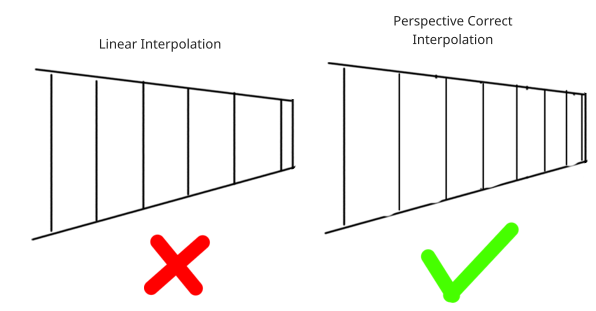
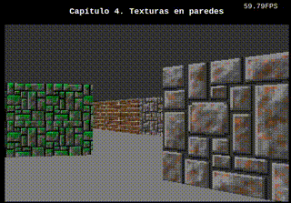

# **Capítulo 4.** Texturas en paredes
En este capítulo vamos a dibujar las paredes con las texturas que hemos cargado. A diferencia del capítulo anterior, no utilizaremos funciones de la Canvas API para dibujar. Nosotros vamos a colorear píxel a píxel empleando algunas técnicas para incrementar el rendimiento.

## Matriz de Píxeles
Como se puede imaginar, el Canvas de html no es más que una matriz de píxeles ordenados igual que en una imagen. La Canvas 2D API define una función para poder ingresar una matriz de píxeles: [putImageData()](https://developer.mozilla.org/en-US/docs/Web/API/CanvasRenderingContext2D/putImageData) que espera recibir un objeto de tipo [ImageData](https://developer.mozilla.org/en-US/docs/Web/API/ImageData).

**Nota:** Aunque la llamemos "Matriz de píxeles", internamente es un arreglo de una dimensión ordenado por columnas o por filas como describimos en el capítulos anterior.

Como todo el engine se basa en dibujar columna por columna ya sabemos que es un beneficio en el rendimiento poder almacenarla en caché. Con esta idea en mente, todo objeto debería dibujar primero sobre la columna y luego se debería transferir a la matriz de píxeles.

## Renderer
Para mantener el código más limpio, unificamos los objetos Canvas y Screen en `Renderer`. Este objeto tendrá la referencia al Viewport principal que antes era global. Adicionalmente, tendrá la matriz de píxeles y la columna donde los demás objetos dibujan.
```javascript
const Renderer = {
    width: 320,
    height: 200,

    init(canvas) {
        // DOM Elements
        this.canvas = canvas
        this.buffer = document.createElement("canvas") // Doble buffering

        // Resolutions
		canvas.width  = this.buffer.width  = this.width
        canvas.height = this.buffer.height = this.height
		canvas.style.width  = this.width * 2  + "px"
        canvas.style.height = this.height * 2 + "px"

        // Contexts
        this.ctx  = this.canvas.getContext("2d")
        this.bctx = this.buffer.getContext("2d")

        // Pixel Data
        this.pixelsLength = this.width * this.height * 4 // 4 porque cada píxel es RGBA
        this.pixels = new Uint8ClampedArray(new ArrayBuffer(this.pixelsLength)).fill(255)
        this.imageData = new ImageData(this.pixels, this.width, this.height)
        this.column = new Uint8Array(this.height * 4).fill(255)

        // Viewport
        this.MainViewport = Viewport(this.width)
    },

    draw() {
        // Pseudocódigo
        Inicialización de MainViewport
        por cada columna {
            MainViewport dibuja en columna
            this.drawColumn(columna)
        }

        this.bctx.putImageData(this.imageData, 0, 0)
        this.ctx.drawImage(this.buffer, 0, 0)
    },

    drawColumn(col) {
        let i = col << 2
        for (let y = 0; y < this.column.length; y+=4) {
            this.pixels[i]   = this.column[y]
            this.pixels[i+1] = this.column[y+1]
            this.pixels[i+2] = this.column[y+2]
            this.pixels[i+3] = this.column[y+3]
            i += this.width << 2
        }
    }
}
```

**Nota:** Tendremos que actualizar todos los archivos donde se hacía referencia a Screen o Canvas y cambiarlos por Renderer.

Unos de los trucos que usaremos de acá en adelante es reemplazar la multiplicación por un *left shift* `<<`. De esta forma: `a << log2(b) = floor(a) * b` siempre y cuando `b` sea potencia de 2. Esto también se aplica a la división: `a >> log2(b) = floor(a) / b`. Emplear operadores binarios es mucho más rápido que efectuar una multiplicación o división, con el agregado adicional de que redondea `a` hacia abajo.

## Viewport
`Viewport` como todo objeto renderizable requiere dos funciones una "project" y una "draw". Adicionalmente, necesita dos variables auxiliares: top y bottom. Estas indican los límites superior e inferior de la columna donde se puede dibujar. (Son los límites de oclusión, pero profundizaremos sobre este tema en el Capítulo 7).
```javascript
const Viewport = (width) => ({
    // Buffers con información de cada columna
    closest: new Array(width),
    depth:   new Array(width).fill(0),

    clear() {
        this.top = 0
        this.bottom = Renderer.height
        this.depth.fill(0)
    },

    loadBuffers() {
        for (const s of this.sector.visibles) {

            const from = Math.max(0, Math.min(width - 1, s.p0.col))
            const to   = Math.max(0, Math.min(width - 1, s.p1.col))

            for (let c = from; c <= to; c++) {
                const d = s.getDepthAt(c)
                if (d > this.depth[c]) {
                    this.closest[c] = s
                    this.depth[c] = d
                }
            }
        }
    },

    project() {
        this.clear()
        this.sector.project()
        this.loadBuffers()
    },

    draw() {
        const segment = this.closest[this.x]
        if (segment) {
            this.drawLine(0, Math.max(segment.getTopAt(this.x), this.top), 50, 50, 50) // Techo
            this.drawLine(Math.min(segment.getBottomAt(this.x), this.bottom), Renderer.height - 1, 123, 123, 123) // Suelo
            segment.wall.draw(this)
        }
    },
    
    drawLine(from, to, r, g, b) {
        for (from <<= 2, to <<= 2; from < to; from+=4) {
            Renderer.column[from] = r
            Renderer.column[from+1] = g
            Renderer.column[from+2] = b
        }
    }
})

```
La función `draw` tiene la estructura vista en `Views.screenSpace`: en la columna indicada, busca qué segmento está proyectado ahí. Si existe, dibuja el techo, el suelo y la Wall.\
Como puede verse, Viewport necesita saber en qué columna "x" está dibujando para poder encontrar que Wall está proyectada ahí.\
Para dibujar el techo y el suelo, temporalmente, se implementó una función auxiliar: `drawLine`. En el próximo capítulo la reemplazaremos por una clase que se encargue de ello.

Ahora podemos completa el `Renderer`:
```javascript
const Renderer = {
  . . .
  draw() {
        this.MainViewport.project()

        this.MainViewport.x = 0
        while(this.MainViewport.x < this.width) {
            this.MainViewport.draw()
            this.drawColumn(this.MainViewport.x)
            this.MainViewport.x++
        }

        this.bctx.putImageData(this.imageData, 0, 0)
        this.ctx.drawImage(this.buffer, 0, 0)
    },
  . . .
}
```
## Dibujando la textura
Para dibujar la textura correctamente dentro del área projectada de la wall se emplea un método llamado [Texture Mapping](https://en.wikipedia.org/wiki/Texture_mapping). Con este método vamos a partir de las coordenadas del píxel en pantalla y las vamos a mapear con el [Texel](https://en.wikipedia.org/wiki/Texel_(graphics)) de la textura. Un texel tiene coordenadas U y V que vamos a calcular individualmente.
### Obteniendo U
Cuando dibujamos las paredes tuvimos en cuenta que a medida que estas se alejaban se veían más pequeñas en pantalla. Un efecto similar ocurre con las texturas. A medida que la pared se aleja de la pantalla, la textura se "comprime". La siguiente imagen ilustra el efecto:



Para lograrlo se emplea una técnica llamada [Perspective Correct Interpolation](https://www.scratchapixel.com/lessons/3d-basic-rendering/rasterization-practical-implementation/perspective-correct-interpolation-vertex-attributes) que, a diferencia de una interpolación lineal, tiene en cuenta el factor Z (profundidad de pantalla).\
De esta forma se puede obtener la fórmula que expresa el valor de U:
$$U = \frac{U_0 \times Z_0^{-1} + (U_1 \times Z_1^{-1} - U_0 \times Z_0^{-1}) \Delta x}{Z_0^{-1} + (Z_1^{-1} - Z_0^{-1}) \Delta x}$$
Analicemos variable por variable. Los subíndices indican si la variable corresponde a P0 o a P1.
- $Z^{-1}$ es lo que nosotros definimos como **depth** y se encuentra en P0 y P1.
- $\Delta x$ es un valor entre 0 y 1 que indica en qué proporción en X de la wall estamos. 0: sobre la columna de P0, 1: sobre la columna de P1. Se obtiene con la interpolación lineal: $\Delta x = \frac{x - col_0}{col_1 - col_0}$. Siendo $x$ la columna de la pantalla que estamos dibujando.
- $U_0$ y $U_1$ son valores que indican qué valor U tienen P0 y P1 respectivamente.

Cuando P0 es totalmente visible en pantalla, su componente $U_0$ debe ser 0 para indicar el comienzo de la textura. Por otro lado, P1 debería estar en el límite derecho de la wall. Este valor es el ancho de la textura multiplicado el largo de la wall: $L_U = T_w \times L$.\
El largo de la wall es el largo de su Segment, lo que implica que debemos calcular durante la inicialización del Segment:
```javascript
/* --- Segment.js --- */
const Segment = (x0, y0, x1, y1) => ({
    p0: Point(x0, y0), // Initial Point
    p1: Point(x1, y1), // End Point
    length: Math.sqrt((x1 - x0) * (x1 - x0) + (y1 - y0) * (y1 - y0)),
	. . .
})
```
Durante el *Near Plane Culling* en la proyección del Segment en el *Depth Space* se alteran las coordenadas de P0 y P1. Esto quiere decir que ya no representan el límite izquierdo (0) y derecho (L_U) de la textura de la wall. Para tener en cuenta este desfase, necesitamos valernos de una variable auxiliar en cada punto: `l`. `l` es un valor entre 0 y 1 que indica en qué porcentaje de la totalidad de la longitud de la wall se encuentra el punto.\
Entonces, ahora podemos agregar este parámetro en el Near Plane Culling:
```javascript
const Segment = (x0, y0, x1, y1) => ({
    . . .
    toDepthSpace() {
        . . .
        this.p0.l = 0
        this.p1.l = 1

		/* Near Plane Culling */
		if (yp0 > Camera.nearPlane) {
			const dy = (Camera.nearPlane - yp0) / (yp1 - yp0)
            this.p0.l = dy
            . . .
		} else if (yp1 > Camera.nearPlane) {
			const dy = (Camera.nearPlane - yp1) / (yp0 - yp1)
            this.p1.l = 1 - dy
            . . .
		}
  	  . . .
	}
}
```
De esta forma:
$$U_0=L_0 \times T_w \times L$$
$$U_1=L_1 \times T_w \times L$$
Teniendo en cuenta los modificadores *offset* y *scale* de la textura, la variable U queda:
$$U_0=offset_U + L_0 \times \frac{T_w}{scale_U} \times L$$
$$U_1=offset_U + L_1 \times \frac{T_w}{scale_U} \times L$$
Si la wall no varía su *length*, se puede precalcular el ancho en píxeles de la wall sobre la coordenada *U*. Este precálculo se realiza en el Linker, que es el momento a partir del cual conocemos el ancho de la textura:
```javascript
const Linker = {
    . . .
    linkWall(wall) {
        TextureLoader.getTexture(wall.texture.name, texture => {
            . . .
            wall.texture.w    = texture.w

            wall.texture.lengthU = texture.w * wall.segment.length / wall.texture.scaleU
        })
    },
	. . .
}
```
Entonces:
$$U_0=offset_U + L_0 \times L_U$$
$$U_1=offset_U + L_1 \times L_U$$
### Obteniendo V
El mapeo de la componente vertical con V, es más sencillo. Como dibujamos la columna entera desde arriba hacia abajo, partimos desde un V inicial avanzamos un paso $\Delta V$ por cada píxel vertical que dibujamos.\
La altura de la Wall es la diferencia de alturas entre el techo y el suelo: $W_h = ceiling_Z - floor_Z$.\
Si la multiplicamos por $T_h / scale_V$, obtenemos el alto en píxeles de la wall, de forma similar a como obtuvimos el ancho en U.\
Si dividimos por el alto en píxeles de la pared proyectada ($bottom - top$) obtenemos el paso $$\Delta V = \frac{(ceiling_Z - floor_Z) \times \frac{T_h}{scale_V}}{bottom - top}$$
*bottom* y *top* son valores de la proyección de la wall, y pueden no estar dentro de los límites de la pantalla. Es por ello que es necesario encontrar entre qué par de píxeles dentro de la pantalla hay que dibujar la columna de la wall:
$$t = max(top, top_{viewport})$$

$$b = min(bottom, bottom_{viewport})$$

Este posible corrimiento en *t* respecto de la variable *top* original nos afecta al valor inicial de V, el cual debe comenzar desplazado. De esta forma V inicial:
$$V_i = offset_V + (t - top) \times \Delta V$$
### Dibujo
Suficientes cuentas por ahora, vamos a pasar al código
```javascript
const Wall = () => ({
    culling() {
        this.texture.u0 = this.texture.offU + this.segment.p0.l * this.texture.lengthU
        this.texture.u1 = this.texture.offU + this.segment.p1.l * this.texture.lengthU
    },

    draw(viewport) {
        this.culling()

        const s = this.segment,
            texture = this.texture;

        const dx = (viewport.x - s.p0.col) / (s.p1.col - s.p0.col)
        
        // Cálculo U
        const depth  = s.p0.depth  + (s.p1.depth  - s.p0.depth)  * dx
        const uinv = texture.u0 * s.p0.depth + (texture.u1 * s.p1.depth - texture.u0 * s.p0.depth) * dx
        const i0 = ((uinv / depth) & (texture.w - 1)) * texture.h // Desplazamiento inicial en i

        // Cálculo V
        const top    = s.p0.top    + (s.p1.top    - s.p0.top)    * dx
        const bottom = s.p0.bottom + (s.p1.bottom - s.p0.bottom) * dx
        const dv = (viewport.sector.ceiling.z - viewport.sector.floor.z) * texture.h / ((bottom - top) * texture.scaleV)

        const b = Math.min(bottom, viewport.bottom) << 2
        let y = Math.max(~~top, viewport.top)

        let v = texture.offV + (y - top) * dv

        for (y <<= 2; y < b; y+=4, v+=dv) {
            const i = (i0 + (v & (texture.h - 1))) << 2

            Renderer.column[y]   = texture.data[i]
            Renderer.column[y+1] = texture.data[i+1]
            Renderer.column[y+2] = texture.data[i+2]
        }
    },

})
```
Notar que para que U y V siempre se mantengan dentro de las dimensiones de las texturas es necesario hacer el módulo: $U' = U \\% T_w$ y $V' = V \\% T_h$.\
Como asumimos que las texturas con las que trabaja el engine tiene dimensiones que son potencia de 2 (8x8, 16x16, 32x32, 8x16, etc), se puede hacer un truco para evitar hacer el módulo y ganar performance: $U' = U \\& (T_w - 1)$ y $V' = V \\& (T_h - 1)$.\
Los otros operadores binarios utilizados son `<< 2` para multiplicar por 4 (recuerde las componente RGBA en la matriz de píxeles) y `~~` que es una forma de obtener la parte entera de un número y evitar usar `Math.floor`.
## Esperar la carga
Cuando enviamos a cargar un paquete de texturas al TextureLoader se cargan una a una de forma asíncrona, es decir, no sabemos exactamente cuándo termina. Si intentamos empezar a renderizar antes de que estén completamente cargadas, vamos a tener errores visuales. Para solucionarlo dentro de [TextureLoader](./src/loaders/TextureLoader.js) se agregó la funcionalidad de invocar a un *callback* una vez que se cargaron todas las texturas pendientes. Y en [main](./src/main.js) se utiliza para iniciar el loop principal.\
Adicionalmente, se agregó un contador de FPS que vamos a asegurarnos de ahora en más que siempre esté cercano a los 60FPS.
## Conclusión
El resultado debería verse como el siguiente:



Para tener una idea intuitiva de lo que está ocurriendo en pantalla, recomiendo variar algunos parámetros o fórmulas. También recomiendo editar el archivo de nivel y agregar nuevas texturas.