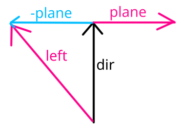
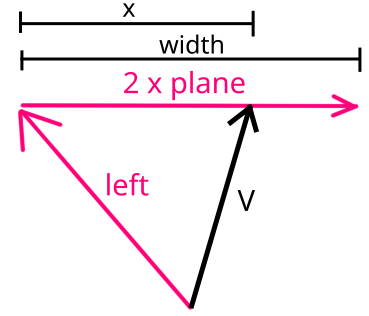
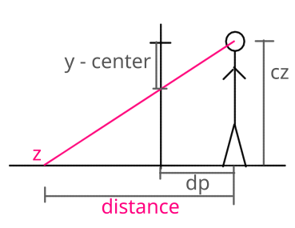
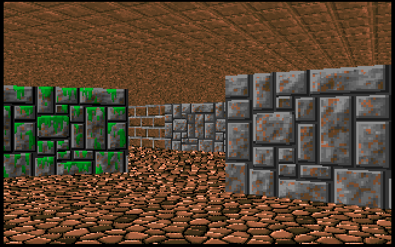
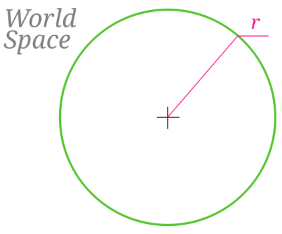
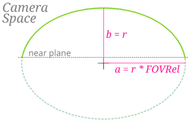
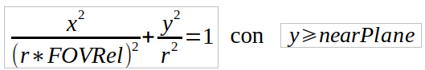
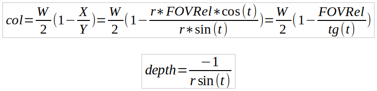
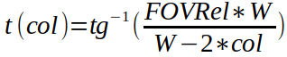
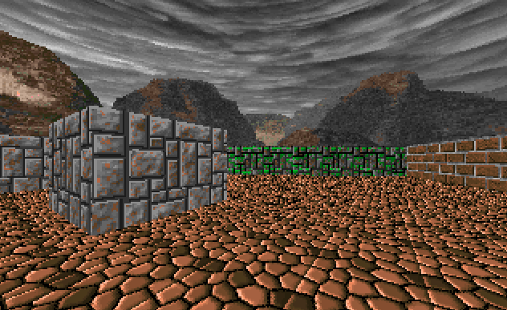

# **Capítulo 5.** Texturas en suelo y techo. Parallax
> *Código fuente*: [Source](./src) 

En este capítulo vamos a ver cómo agregar la textura del suelo y el techo en el archivo de disñeo. Luego realizaremos el mapeo de la textura creando varias clases adicionales. Por último, agregaremos el efecto de Parallax que sirve para simular exteriores y otros efectos.\
Tanto al techo como al suelo los vamos a englobar en un único concepto: el `Flat`. El mismo, hace referencia a una superficie plana.

## Diseño
Dentro de nuestro archivo de diseño queremos especificar, además de la componente Z, la textura de nuestro flat. Si usa el formato TOML el archivo debería verse como el siguiente fragmento:
```
name = "first_level"
[[sectors]]
    name = "main"

    [sectors.floor]
    texture = "stone_o"

    [sectors.ceiling]
    z = 2
    texture = "wood"
```
Para estructurar mejor el código crearemos dos constructores `Ceiling` y `Floor` en sus respectivos archivos dentro de la carpeta `flats`.
```javascript
const Ceiling = () => ({
  draw() {
    ...
  }
})
```
```javascript
const Floor = () => ({
  draw() {
    
  }
})
```
De forma similar a como hicimos con las walls necesitamos agregar entradas en el Parser y el Linker para procesar la información de diseño de los flats:
```javascript
const Parser = {
    . . .
  
    parseSector(name, info) {
        const sector = Sector(name)

        sector.floor = this.parseFloor(info.floor)
        sector.ceiling = this.parseCeiling(info.ceiling)

        . . .
    },

    parseFloor(info) {
        const floor = Floor()

        floor.z = info.z || 0
        floor.texture = this.parseTexture(info.texture)

        return floor
    },

    parseCeiling(info) {
        const ceil = Ceiling()

        ceil.z = info.z || 2
        ceil.texture = this.parseTexture(info.texture)

        return ceil
    },
    . . .
}
```
```javascript
const Linker = {
    . . .
    linkSector(sector) {
        . . .
        this.linkTexture(sector.floor.texture)
        this.linkTexture(sector.ceiling.texture)
    },

    linkTexture(t) {
        TextureLoader.getTexture(t.name, texture => {
            t.data = texture.data
            t.h    = texture.h
            t.w    = texture.w
        })
    },
```
Con eso deberíamos ser capaces de ver la textura cargada tanto en .floor como en .ceiling
## Cámara
Primero vamos a definir algunas propiedades adiconales de la cámara:



Como puede verse en la figura `dir` es la dirección hacia donde está mirando la cámara. Si rotamos este vector a -90° obtenemos el vector unitario `plane` que representa la dirección del plano de proyección. Para poder aplicarle el efecto de distorsión por el FOV, lo escalamos por la tangente del FOV/2. Por último, si hacemos `dir - plane` obtenemos el vector `left`que representa la primera posición a la izquierda de la pantalla.\
Considerando que vamos a dibujar columna por columna de la pantalla, nos interesa saber a qué vector **V** corresponde una columna **x**. La siguiente figura representa el problema a resolver:



De la figura se puede derivar:

$$V = left + 2 \times plane \times \frac{x}{width}$$

A la expresión $2 \times plane \times 1/width$ la llamamos $delta$, que sintetiza a:

$$V = left + x \times delta$$

Vamos a plasmar estos vectores en el código de `Camera.js`:
```javascript
const Camera = {
    . . .
    center: Renderer.height / 2,
    left:  v2(), delta: v2(),

    setAngle(angle) {
        . . .
        this.updateVectors()
    },

    setFOV(FOV) {
        . . .
        this.updateVectors()
    },

    updateVectors() {
        const planeX = -this.dir.y * this.tanFOV,
              planeY =  this.dir.x * this.tanFOV;

        this.left.x  = this.dir.x - planeX
        this.left.y  = this.dir.y - planeY

        this.delta.x = 2 * planeX / Renderer.width
        this.delta.y = 2 * planeY / Renderer.width
    }
}
```
Notar que adicionalmente agregamos una propiedad llamada `center` que indica la mitad de la pantalla en píxeles.
## Flats
Primero vamos a refactorizar el código de modo tal que Viewport llame a la función `draw` de cada flat. Ceiling va a dibujarse desde el extremo superior de la pantalla, hasta el Top del Segment. Por otro lado, el Floor se dibuja desde el Bottom del Segment hasta el extremo inferior de la pantalla. Estos límites deben pasarse como parámetro al flat.
```javascript
const Viewport = (width) => ({
    . . .
    draw() {
        const segment = this.closest[this.x]
        if (segment) {
            this.sector.ceiling.draw(segment.getTopAt(this.x), this)
            this.sector.floor.draw(segment.getBottomAt(this.x), this)
            segment.wall.draw(this)
        }
    }
})
```
Y en los flats:
```javascript
const Ceiling = () => ({
    draw(to, viewport) {
        if (to < viewport.top) return
		this.y0 = viewport.top
        this.y1 = Math.min(~~to, viewport.bottom)

        this.drawFlat(viewport)
    },
  
    __proto__: Flat
})
```
```javascript
const Floor = () => ({
    draw(from, viewport) {
        if (from > viewport.bottom) return
		this.y0 = Math.max(viewport.top, ~~from)
        this.y1 = viewport.bottom
        
        this.drawFlat(viewport)
    },
  
    __proto__: Flat
})
```
`y0` e `y1` indican desde qué fila hasta qué fila se dibuja el flat.\
La línea `__proto__: Flat` le indica a JavaScript que el objeto creado tiene como prototipo el objeto `Flat`. Esta es una forma explícita de indicar herencia en JavaScript. `Flat` va a contener el código relacionado a la renderización del flat que es común al Floor y al Ceiling:
```javascript
const Flat = {
    drawFlat(viewport) {
        const texture = this.texture
        
        - Inicialización de variables

        for (let y = this.y0; y < this.y1; y++) {
            - Obtenemos U y V

            const Y = y << 2
            const i = (u * texture.h + v) << 2

            Renderer.column[Y]   = texture.data[i]
            Renderer.column[Y+1] = texture.data[i+1]
            Renderer.column[Y+2] = texture.data[i+2]
        }
    }
}
```
## Mapeo de Texturas
Ahora viene la parte matemática: el *mapeo*.\

A partir de la fila **y** en pantalla queremos obtener a qué **distancia** se encuentra de la cámara en un determinado flat. La siguiente figura grafica el problema:



**cz** es la posición Z de la cámara, mientras que **z** es la del flat.\
**center** es la propiedad de la cámara que agregamos en una sección anterior.\
Por igualdad de triángulos sabemos que:

$$\frac{distance}{cz - z} = \frac{dp}{y - center}$$

De donde se obtiene:

$$distance = (cz -z ) \times \frac{dp}{y - center}$$

Puesto en código:
```javascript
const distanceRelation = (Camera.pos.z - this.z) * Camera.dp

for (let y = this.y0; y < this.y1; y++) {
    const rowDistance = distanceRelation / (y - Camera.center)
}
```

Ahora note que si multiplicamos el vector de la cámara de la columna **x** con la **distancia** recién calculada, obtenemos las coordenadas del World Space que se proyectan en un XY de la pantalla.

```javascript
const distanceRelation = (Camera.pos.z - this.z) * Camera.dp
const dirX = Camera.left.x + Camera.delta.x * viewport.x,
      dirY = Camera.left.y + Camera.delta.y * viewport.x;

for (let y = this.y0; y < this.y1; y++) {
    const rowDistance = distanceRelation / (y - Camera.center)
    const x = rowDistance * dirX
    const y = rowDistance * dirY
}
```

Multiplicando esas últimas coordenas por las dimensiones de la textura del flat, obtenemos el U y V.\
Teniendo en cuenta el offset y el scale, nuestro `Flat` queda:
```javascript
const Flat = {
    drawFlat(viewport) {
        const texture = this.texture
        const w = texture.w / texture.scaleU
		const h = texture.h / texture.scaleV

        const distanceRelation = (Camera.pos.z - this.z) * Camera.dp

        const dirX = (Camera.left.x + Camera.delta.x * viewport.x) * w,
              dirY = (Camera.left.y + Camera.delta.y * viewport.x) * h;

        for (let y = this.y0; y < this.y1; y++) {
            const rowDistance = distanceRelation / (y - Camera.center)

            const u = (texture.offU + rowDistance * dirX) & (texture.w - 1),
                  v = (texture.offV + rowDistance * dirY) & (texture.h - 1);

            const Y = y << 2
            const i = (u * texture.h + v) << 2

            Renderer.column[Y]   = texture.data[i]
            Renderer.column[Y+1] = texture.data[i+1]
            Renderer.column[Y+2] = texture.data[i+2]
        }
    }
}
```
El resultado debe verse similar a:



## Parallax
Si nuestro mapa contiene sectores al aire libre es posible que querramos mostrar un cielo o montañas que nos rodean y den la sensación adecuada. Para lograr este efecto, necesitamos que la textura de nuestro fondo aparente estar en la lejanía. Se supone que se encuentra estática en un lugar muy lejano e inalcanzable, lo que implica que aunque uno se intente acercar el fondo siempre parece distante. A este efecto lo llamamos **parallax**.\
En un Engine 3D tradicional, esto se logra con una [Skybox](https://en.wikipedia.org/wiki/Skybox_(video_games)). Nosotros, simplemente, dibujaremos la textura con una transformación que garantice el efecto visual.\
Partimos teniendo una textura dentro de nuestro paquete que represente el cielo. La asignamos en el archivo de diseño a nuestro ceiling junto con una nueva propiedad booleana: **parallax**.

```javascript
[sectors.ceiling]
    z = 2
    texture = "sky"
    parallax = true
```
En el parser se adquiere como:
```javascript
. . .
parseCeiling(info) {
  const ceil = Ceiling()

  ceil.z = info.z || 2
  ceil.texture = this.parseTexture(info.texture)
  ceil.parallax = !!info.parallax

  return ceil
},
. . .
```

Ahora empecemos con las matemáticas. Dijimos que la textura nos debe rodear, es natural, entonces, que pensemos en curvar la textura como en un círculo de radio **r** centrado en la posición de la cámara. En el *World Space* se vería como: 



Recordando la Transformación de World Space a Camera Space el Círculo planteado se transforma en una elipse. Geométricamente, un elipse posee un semieje mayor (*a*) al cual lo alineamos con el eje X y un semieje menor (*b*) alineado con el eje Y. Debido a que tenemos un FOV variable, en el Camera Space escalamos el eje X. De esta forma, `b = r` debido a que no se escala en Y y `a = r * Camera.FOVRelation`.

Gráficamente, el *Camera Space* se vería como:



Como puede verse en la anterior figura, solo vamos a considerar la porción del eclipse que esté por delante del near plane.

La ecuación que define una elipse por medio de sus semiejes es:



El algoritmo de renderización universal del Engine consiste en renderizar columna por columna de una textura. Siendo que nuestra textura de parallax se encuentra muy lejana, necesitamos saber para cada columna de pantalla que coordenada U corresponde. Como acabamos de ver, la ecuación de una Elipse consta de dos variables: *x* e *y* que son imposibles de despejar a partir de una única entrada (*col*). Afortunadamente, existe una relación implícita entre *x* e *y* que nos permite parametrizar la elipse empleando una única variable **t**:

```
x = a * cos(t) = r * FOVRel * cos(t)
y = b * sin(t) = r * sin(t)
```

Para la transformación del *Camera Space* al *Depth Space* recurrimos a las ecuaciones de `col` y `depth`, reemplazando X e Y, por las ecuaciones parametrizadas de nuestra elipse:



Para obtener *t* en función de *col* simplemente debemos despejar:



Podemos obtener *depth* inyectando el valor obtenido de *t* a partir de *col*. Con esta coordenada, ya podemos pasar al *Screen Space*:

```
screenY = center - (Z - cameraZ) * dp * depth
```

¿Qué valor de Z corresponde? Para una Wall, el bottomZ y topZ coinciden con la coordenada Z del suelo y del techo, respectivamente. Pero para un Parallax, vamos a considerar que el bottomZ coincide con la coordenada Z de la cámara y que el topZ sea la cameraZ más una altura definida por el usuario en el scaleV de la textura. De esta forma:

```
top = center - scaleV * dp * depth
bottom = center
```

Ya tenemos toda la información necesaria para calcular las coordenadas U y V de la textura del Parallax, para cada píxel en pantalla.

La textura está plegada formando un círculo alrededor de la cámara. Es evidente que existe un mapeo entre el ángulo de dirección de la cámara y la coordenada horizontal (U) de la textura. Si observamos bien en la función `t(col)`, empleamos un arcotangente que nos retorna un ángulo. Es decir, que tenemos el ángulo de cada columna en pantalla que debemos mapear con U, de la siguiente forma:

```
angle = Camera.angle + t(col)
U = angle/2PI  *  Texture.w/scaleU 
```

Realizar los cálculos trigonométricos cada vez que queremos dibujar una única columna del parallax, es bastante costoso para la CPU. La solución más básica es crear un *Lookup Table* que almacene los valores precalculados de `dp * depth` para cada columna de la pantalla.

En `Camera`, agregamos las lookup tables, una que nos va a servir para la componente U y otra para V:

```javascript
const Camera = {
    . . .
    setFOV(FOV) {
        . . .
        // Lookup Parallax
        this.parallaxU = new Array(Renderer.width).fill(0).map((_,col) => Math.atan2(this.FOVRelation * Renderer.width, Renderer.width - col * 2))
        this.parallaxV = this.parallaxU.map(col => this.dp / Math.sin(col))
        . . .
    },
    . . .
}
```

Las calculamos en la función `setFOV` debido a que conviene crearlos cada vez que cambia el FOV. La función `Math.atan2(y, x)` calcula en arcotangente y nos garantiza un resultado aun cuando `x=0`. `parallaxU` nos da el valor del ángulo en función de la columna. `parallaxV` es simplemente `dp * depth`.

Por último creamos la función `drawParallax` en `Flat`:

```javascript
const Flat = {
  . . .
  drawParallax(viewport) {
        const texture = this.texture
        const w = texture.w / (texture.scaleU * 2 * Math.PI)

        const angle = Camera.angle + Camera.parallaxU[viewport.x]
        const i0 = ((angle * w) & (texture.w - 1)) * texture.h

        const top = Camera.center - texture.scaleV * Camera.parallaxV[viewport.x]
        let y = Math.max(~~top, viewport.top)
        const b = Math.min(Camera.center, viewport.bottom) << 2
        const dv = texture.h / (Camera.center - top)

        let v = (y - top) * dv

        for (y <<= 2; y < b; y+=4, v+=dv) {
            const i = (i0 + (v & (texture.h - 1))) << 2

            Renderer.column[y]   = texture.data[i]
            Renderer.column[y+1] = texture.data[i+1]
            Renderer.column[y+2] = texture.data[i+2]
        }
    }

}
```
En `Ceiling` debemos multiplexar la función de dibujo de acuerdo a si es parallax o no:
```javascript
const Ceiling = () => ({
    . . .
    draw(to, viewport) {
        . . .
        if (this.parallax)
            this.drawParallax(viewport)
        else
            this.drawFlat(viewport)
    }
})
```
De esta forma, debería verse el resultado con Parallax:



Para tener parallax `Floor` se realizan los mismo pasos. La función drawParallax de Flat se aplica para ambos.
## Textura Relativa
Un último efecto antes de cerrar el capítulo: la Textura Relativa. Es relativa a la primera wall del sector. Esto quiere decir que se la wall se mueve tambień lo debe hacer el Flat relativo. Esto es particularmente útil cuando se tiene un sector en movimiento y la textura del Flat tiene que moverse junto con él como dentro de un tren, o una plataforma.\
En parser agregamos el campo `isRelative` para el Flat:
```javascript
parseCeiling(info) {
  . . .
  ceil.isRelative = !!info.isRelative
  . . .
},
  
parseFloor(info) {
  . . .
  floor.isRelative = !!info.isRelative
  . . .
},
```
En el Linker agregamos la referencia en el Sector al punto del cual es relativo el Flat:
```javascript
const Linker = {
    . . .
    linkSector(sector) {
        for (const segment of sector.segments)
            this.linkWall(segment.wall)

        sector.reference = sector.segments[0].p0

        this.linkTexture(sector.floor.texture)
        this.linkTexture(sector.ceiling.texture)
    },
    . . .
```
Esto nos genera un desplazamiento adicional respecto del offset de la textura. En `Flat`:
```javascript
const u0 = this.isRelative ? viewport.sector.reference.x : 0
const v0 = this.isRelative ? viewport.sector.reference.y : 0
const distanceRelation = (Camera.pos.z - this.z) * Camera.dp

const offU = texture.offU + (Camera.pos.x - u0) * w,
      offV = texture.offV + (Camera.pos.y - v0) * h;

. . .
for (let y = this.y0; y < this.y1; y++) {
  . . .
  const u = (offU + rowDistance * dirX) & (texture.w - 1),
        v = (offV + rowDistance * dirY) & (texture.h - 1);
  . . .
}
```
## Conclusión
Con las técnicas aprendidas hasta ahora se pueden diseñar niveles muy básicos con un único Sector similares a los del Wolfenstein 3D. El siguiente salto gráfico es la incorporación de múltiples Sectors con distintas alturas y propiedades.
