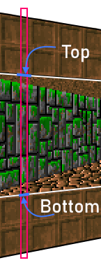

# **Capítulo 7.** Portals. Viewport Occlusion Buffers. Cross Portal detection
> *Código fuente*: [Source](./src) 

## Portal
Un **Portal** es un tipo de wall que conecta dos sectores en una única dirección, por lo tanto, permite el pasaje desde uno hacia otro. Se puede pensar como una ventana hacia otro sector, a diferencia de la **Solid Wall** que es una textura sólida de una pared. En un nivel tradicional, vamos a encontrar portales ubicados en las puertas, ventanas, corredores, escaleras, etc. Este sistema es empleado en los llamados: *Portal Based Engine*.\
El proceso de renderización comienza en el sector donde se encuentra la cámara. Dibuja las walls del sector actual, y cuando encuentra un portal se ingresa al sector adyacente. Luego las walls de ese sector son procesadas.\
Al momento de dibujar un portal, si el suelo del siguiente sector se encuentra más arriba que el suelo del sector actual, entonces hay que dibujar un escalón hacia arriba (*Step Up*). De igual forma, si el techo del siguiente sector está por debajo del actual, entonces se dibuja un *Step Down*.\
Ambos steps pueden tener texturas diferentes y las vamos a almacenar en los campos *lower* y *upper* del Portal. Recuerde que en una Solid Wall tiene su textura en la propiedad *texture*.\
Ahora, un segment en su campo **wall** va a tener una referencia a una wall sólida o un portal. Adicionalmente, el portal debe tener un Viewport desde el cual se visualiza el sector adyacente. La siguiente figura demuestra la disposición gráfica de un portal.\

## Implementación
Lo primero es crear el prototipo del Portal en `Portal.js`. La estructura es similar a una Wall: 
```javascript
const Portal = () => ({
    isPortal: true, // Para diferenciar a una Solid Wall de un Portal

    clipping() {
        // Tenemos que hacerlo para ambas texturas
        this.upper.u0 = this.upper.offU + this.segment.p0.l * this.upper.lengthU
        this.upper.u1 = this.upper.offU + this.segment.p1.l * this.upper.lengthU
        this.lower.u0 = this.lower.offU + this.segment.p0.l * this.lower.lengthU
        this.lower.u1 = this.lower.offU + this.segment.p1.l * this.lower.lengthU
    },
    
    draw(viewport) {
        this.clipping()
        . . .
        Dibujar Step Up
        Dibujar Step Down
        Dibujar viewport
    }
})

```

### Archivo de Diseño
La referencia al sector que continúa está contenida en el campo **next** del portal. Las texturas del Step Down y el Step Up se indican en los campos **upper** y **lower** respectivamente.
```toml
[[sectors]]
    name = "main"

    [sectors.floor]
    texture = "stone_o"

    [sectors.ceiling]
    z = 2
    texture = "wood"

    [[sectors.loops]]
    name = "border"
    v = [0,0, 6,2, 20,2, 27,14, 16,14, 3,14, 9,8]
    walls = [
        {texture = "brick 2,2"},
        {texture = "stone 2,2"},
        {texture = "mossy 2,2"},
        {texture = "brick 2,2"},
        {texture = "wood 2,2"},
        {texture = "mossy 2,2"},
        {texture = "mossy 2,2"}
    ]

    [[sectors.loops]]
    name = "inner"
    v = [12,6, 12,9, 15,9, 15,6]
    walls = [
        {lower = "brick", upper = "mossy", next = "internal"},
        {lower = "brick", upper = "mossy", next = "internal"},
        {lower = "brick", upper = "mossy", next = "internal"},
        {lower = "brick", upper = "mossy", next = "internal"}
    ]

[[sectors]]
    name = "internal"

    [sectors.floor]
    z = 0.5
    texture = "stone_o"

    [sectors.ceiling]
    z = 1.7
    texture = "wood"

    [[sectors.loops]]
    name = "border"
    v = [15,6, 15,9, 12,9, 12,6]
    walls = [
        {texture = "stone", next = "main"},
        {texture = "stone", next = "main"},
        {texture = "stone", next = "main"},
        {texture = "stone", next = "main"}
    ]
```
### Parser y Linker
Agregamos las funciones que procesan la información del Portal en el Parser y el Linker.
```javascript
const Parser = {
	. . .
    parseWall(info) {
        let wall;

        if (info.next) {
            wall = Portal()

            if (info.texture) {
                wall.lower = wall.upper = this.parseTexture(info.texture)
            } else {
                wall.upper = this.parseTexture(info.upper)
                wall.lower = this.parseTexture(info.lower)
            }

            wall.next = info.next
        } else {
            wall = Wall()

            wall.texture = this.parseTexture(info.texture)
        }

        return wall
    },
    . . .
}

```
```javascript
const Linker = {
    linkLevel(level) {
        for (const sector in level.sectors)
            this.linkSector(level.sectors[sector], level)

        this.linkPlayer(level.player, level)
    },
  
    linkSector(sector, level) {
        for (const segment of sector.segments) {
            if (segment.wall.isPortal)
                this.linkPortal(segment.wall, level)
            else
                this.linkWall(segment.wall)
            segment.sector = sector
        }

        sector.reference = sector.segments[0].p0

        this.linkTexture(sector.floor.texture)
        this.linkTexture(sector.ceiling.texture)

        sector.floor.sector = sector.ceiling.sector = sector
    },

    . . .

    linkPortal(wall, level) {
        TextureLoader.getTexture(wall.upper.name, texture => {
            wall.upper.data = texture.data
            wall.upper.h    = texture.h
            wall.upper.w    = texture.w

            wall.upper.lengthU = texture.w * wall.segment.length / wall.upper.scaleU
        })
        TextureLoader.getTexture(wall.lower.name, texture => {
            wall.lower.data = texture.data
            wall.lower.h    = texture.h
            wall.lower.w    = texture.w

            wall.lower.lengthU = texture.w * wall.segment.length / wall.lower.scaleU
        })
        wall.next = level.sectors[wall.next]
    },

   . . .

}

```
## Pool de Viewports
Como mencionamos, cada Portal requiere un Viewport asociado. Si creáramos un Viewport por cada Portal existente, ocuparíamos demasiado espacio en memoria innecesariamente, debido a que no siempre son visibles.\
Una solución más elegante consiste en asignar los Viewports a demanda para los Portals que son visibles en un determinado frame. De esta forma, solo necesitamos crear un número fijo de Viewports y reciclarlos a medida que se requiera.\
El objeto que adminsitra los Viewports es el `ViewportsPool`:
```javascript
const ViewportsPool = {
    length: 0,

    init() {
        this.viewports = new Array(256).fill(0).map(_ => Viewport(Renderer.width))
    },
    
    take() {
        const viewport = this.viewports[this.length]
        this.length++
        return viewport
    },

    clear() {
        this.length = 0
    }
}
```
Hasta ahora, como teníamos un único Viewport (el MainViewport) en el Renderer especificamos la renderización del mismo de la siguiente forma:
```javascript
while (this.MainViewport.x < this.width) {
    this.MainViewport.draw()

    this.drawColumn(this.MainViewport.x)
    this.MainViewport.x++
}
```
Y en `main` inicializamos el Viewports Pool:
```javascript
ViewportsPool.init()
```
## Stack de Viewports
Ahora requerimos, adicionalmente, invocar la renderización de todos los viewports existentes en una columna. Estos se van a ir apilando en un stack dentro del renderer. Luego, uno por uno se invocan. Para ello tendremos que realizar algunos cambios en Renderer:
```javascript
const Renderer = {
    . . .
    viewports: new Array(10), // Stack de Viewports a dibujar en la columna
	length: 0,                // Cantidad de Viewports apilados
    . . .

    draw() {
        this.MainViewport.project()

        this.MainViewport.x = 0

        while (this.MainViewport.x < this.width) {
            this.MainViewport.draw()
            while (this.length)
                this.viewports[--this.length].draw()

            this.drawColumn(this.MainViewport.x)
            this.MainViewport.x++
        }

        this.bctx.putImageData(this.imageData, 0, 0)
        this.ctx.drawImage(this.buffer, 0, 0)

        ViewportsPool.clear()
    },

    . . .

    stackViewport(viewport) {
        this.viewports[this.length++] = viewport
    }
}
```

## Renderización
Pasemos a dibujar el Portal que está compuesto por los steps y por un viewport.
### Step Up y Step Down
Podemos pensar a los steps como walls sólidas que solo se dibujan en una porción de la columna. Con esta idea en mente reciclamos el código de `Wall` en una función llamada `drawPlane`.
```javascript
const Portal = () => ({
    . . .    
    draw(viewport) {
        const bottomZ = this.segment.bottomZ
        const topZ    = this.segment.topZ

        // Step UP
        if (this.next.floor.z > bottomZ) {
            this.segment.toScreenSpace(this.next.floor.z, bottomZ)
            this.drawPlane(this.lower, viewport)
        }

        // Step DOWN
        if (this.next.ceiling.z < topZ) {
            this.segment.toScreenSpace(topZ, this.next.ceiling.z)
            this.drawPlane(this.upper, viewport, 0, 1)
        }

        Dibujar Viewport
    },

    drawPlane(texture, viewport, topFactor = 1, bottomFactor = 0) {
        const s = this.segment

        const dx = (viewport.x - s.p0.col) / (s.p1.col - s.p0.col)
        
        // Cálculo U
        const depth  = s.p0.depth  + (s.p1.depth  - s.p0.depth)  * dx
        const uinv = texture.u0 * s.p0.depth + (texture.u1 * s.p1.depth - texture.u0 * s.p0.depth) * dx
        const i0 = ((uinv / depth) & (texture.w - 1)) * texture.h

        // Cálculo V
        const top    = s.p0.top    + (s.p1.top    - s.p0.top)    * dx
        const bottom = s.p0.bottom + (s.p1.bottom - s.p0.bottom) * dx
        const dv = s.height * texture.h / ((bottom - top) * texture.scaleV)

        const b = Math.min(bottom, viewport.bottom) * 4
        let y = Math.max(~~top, viewport.top)

        if (b < 0 || y > Renderer.height) return

        let v = texture.offV + (y - top * topFactor - bottom * bottomFactor) * dv

        for (y *= 4; y < b; y+=4, v+=dv) {
            const i = (i0 + (v & (texture.h - 1))) << 2

            Renderer.column[y]   = texture.data[i]
            Renderer.column[y+1] = texture.data[i+1]
            Renderer.column[y+2] = texture.data[i+2]
        }
    }
})

```
En la función `draw` verificamos si es necesario dibujar los steps: si la diferencia de alturas es la correcta.\
Para que los cálculos de top, bottom y height relacionados con el segment, sean los correctos, es necesario llevarlo al Screen Space con las alturas adecuadas de los Steps.\
Nuestra función `drawPlane` tiene un ligero cambio con respecto a la de Wall, y es en el cálculo del `v` inicial. Este valor ahora depende de si es un Step Up o un Step Down y garantiza consistencia en las texturas.\
`(y - top) * dv` para el Step Up. Al igual que para la Solid Wall\
`(y - bottom) * dv`para el Step Down. Que "invierte" la textura.\
Luego en `toScreenSpace` de Segment, almacenamos los valores de topZ y bottomZ:
```javascript
const Segment = (x0, y0, x1, y1) => ({
    . . .
    toScreenSpace(topZ, bottomZ) {
        . . .
        this.height = topZ - bottomZ
        this.topZ = topZ
        this.bottomZ = bottomZ
    },
    . . .
})
```
### Valores de Oclusión
Cuando introdujimos el concepto de **Viewport** creamos dos valores de oclusión asociados: `top` y `bottom`. Las texturas van a ser dibujadas dentro de un viewport solo si se encuentran por debajo del top y por encima del bottom.\
En su momento, los valores eran fijos en 0 y Renderer.height respectivamente. Pero dentro de un Portal esos valores son variables y dependen de la proyección. La siguiente figura ilustra cómo los valores de oclusión representan el límite de renderización.

### Viewport
Entre los steps se ubica el Viewport que debe ser solicitado al ViewportsPool si no lo tiene. Una vez que el Portal tenga su Viewport, proyectamos el segment en el Screen Space para obtener los valores de oclusión y asignarlos al Viewport. Por último, lo apilamos en el stack del Renderer para que se dibuje.
```javascript
const Portal = () => ({
    . . .
    loadViewport() {
        this.viewport = ViewportsPool.take()
        this.viewport.sector = this.next
        this.viewport.segment = this.segment
        this.viewport.project()
    },
    
    draw(viewport) {
        . . .
        this.segment.toScreenSpace(
            Math.min(this.next.ceiling.z, topZ),
            Math.max(this.next.floor.z, bottomZ)
        )

        if (!this.viewport) this.loadViewport()
        this.viewport.top    = Math.max(viewport.top,    ~~this.segment.getTopAt(viewport.x))
        this.viewport.bottom = Math.min(viewport.bottom, ~~this.segment.getBottomAt(viewport.x))
        this.viewport.x = viewport.x
        Renderer.stackViewport(this.viewport)
        
        this.segment.toScreenSpace(topZ, bottomZ) // Restaura el estado original
    },
    . . .
})

```

## Portal Clipping
Ahora el Viewport del Portal tiene asignado el Segment del mismo. Para evitar dibujar paredes innecesariamente vamos a realizar un **Portal Clipping**, que consiste en dibujar solo aquello que esté por delante del segment. Esta separación la logramos comparando con el valor *depth* del segment en cada columna.\
Agregamos, entonces, un nuevo buffer al Viewport: el `boundary` que contiene el valor *depth* para cada columna.
```javascript
const Viewport = (width) => ({
    . . .
    boundary: new Array(width).fill(Infinity),
    . . .

    loadBuffers() {
        for (const s of this.sector.visibles) {

            let from = Math.max(~~(s.p0.col + 1), 0),
                to   = Math.min(~~s.p1.col, width - 1)

            const dd = (s.p1.depth - s.p0.depth) / (s.p1.col - s.p0.col)
            let d = (from - s.p0.col) * dd + s.p0.depth
            for (let c = from; c <= to; c++, d+=dd) {
                if (d < this.boundary[c]) { // Portal Clipping
                    if (d > this.depth[c]) {
                        this.closest[c] = s
                        this.depth[c] = d
                    }
                }
            }
        }
    },

    project() {
        this.segment && this.segment.fillDepth(this.boundary)
        this.clear()
        this.sector.project()
        this.loadBuffers()
    },
    . . .
})

```
Requerimos, adicionalmente, una función auxiliar en Segment: el `fillDepth`, que espera un vector a completar con los valores de depth para todas las columnas que ocupe el Segment en pantalla:
```javascript
const Segment = () => ({
    . . .
    fillDepth(depth) {
        const dd = (this.p1.depth - this.p0.depth) / (this.p1.col - this.p0.col)
        let from = Math.max(0, ~~(this.p0.col + 1)),
            to   = Math.min(Renderer.width-1, ~~this.p1.col)

        let d = (from - this.p0.col) * dd + this.p0.depth
        for (let c = from; c <= to; c++, d+=dd)
            depth[c] = d
    },
    . . .
})
```
## Proyección de Sector
Al tener varios Viewports en pantalla, es posible que más de un Viewport quiera proyectar al mismo sector en un frame. Para evitar que el Sector se proyecte innecesariamente más de una vez por frame, requerimos un mecanismo que nos permita saber si ya fue proyectado en el frame actual.\
Por el lado del Renderer, creamos una variable: `renderId` que nos indica el frame que se está dibujando actualmente e incrementamos su valor en la función draw:
```javascript
const Renderer = {
    . . .
    renderId: 0,
    . . .
    draw() {
        . . .

        this.bctx.putImageData(this.imageData, 0, 0)
        this.ctx.drawImage(this.buffer, 0, 0)
        this.renderId++

        ViewportsPool.clear()
    },

    . . .
}
```
Por el lado del sector, vamos a tener una variable similar, `renderId` que indica el número de frame en el que el sector se proyectó. Solo cuando ambos números difieran vamos a proyectar el sector:
```javascript
const Sector = (name) => ({
    . . .
    project() {
        if (this.renderId === Renderer.renderId) return
        this.renderId = Renderer.renderId
        
        this.visibles.length = 0 // Limpio el arreglo auxiliar
        for (const s of this.segments) {
            if (s.toDepthSpace()) {
                this.visibles[this.visibles.length] = s
                s.toScreenSpace(this.ceiling.z, this.floor.z)
				s.wall.clipping()
            }
            if (s.wall.isPortal && s.wall.viewport) {
                s.wall.viewport = null
            }
        }
    }

})
```
Por ultimo, note que luego de proyectar un segmento, si el mismo tenía un portal, se debe eliminar el viewport de la wall.
## Cross Portal
El último paso es garantizar el pasaje de un sector a otro cuando el jugador se mueve. Al proceso de detección lo llamamos **Cross Portal Detection**. Si trazamos un vector desde la posición t(-1) a la posición en t(0), podemos verificar si atraviesa el segment realizando productos cruzados y evaluando el signo:

En segment, el código es:
```javascript
const Segment = (x0, y0, x1, y1) => ({
    . . .
    isVectorCrossing(ax, ay, bx, by) {
        const abx = bx - ax,                aby = by - ay
		const ajx = this.p1.x - ax,         ajy = this.p1.y - ay
		const ijx = this.p1.x - this.p0.x,  ijy = this.p1.y - this.p0.y
		const ibx = bx - this.p0.x,         iby = by - this.p0.y
		const iax = ax - this.p0.x,         iay = ay - this.p0.y
        return  (aby * iax <= abx * iay) &&
                (ajx * aby <= ajy * abx) &&
                (ijx * iby <= ijy * ibx) &&
                (iax * ijy <= iay * ijx)
    },
    . . .
})
```
Luego en Player
```javascript
const Player = {
    pos: v3(0,0,0),
    last: v3(0,0,0),

    . . .

    update(deltaTime) {
        . . .

        this.last.x = Camera.pos.x
        this.last.y = Camera.pos.y
        this.last.z = Camera.pos.z

        . . .

        this.checkCrossPortal()
    },

    checkCrossPortal() {
        for (const s of this.sector.segments) {
            if (s.isVectorCrossing(this.last.x, this.last.y, Camera.pos.x, Camera.pos.y)) {
                if (s.wall.isPortal) {
                    this.sector = Renderer.MainViewport.sector = s.wall.next
                }
            }
        }
    }
}

```

## Conclusión
Y llegamos al final del capítulo :D\
Debería ver un resultado similar a la siguiente captura:

### Bonus
Con el nivel actual del motor es posible visualizar los WAD del Doom Engine, aunque todavía sin Sprites.\
A partir del proyecto [FreeDoom](https://github.com/freedoom/freedoom) se puede transformar el WAD de los mapas en un nivel de nuestro engine. El resultado es:

El programa se puede encontrar en [FreeDoom-JS](./freedoom-js-v1).