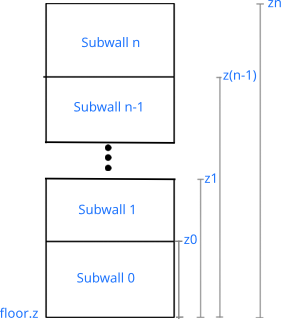
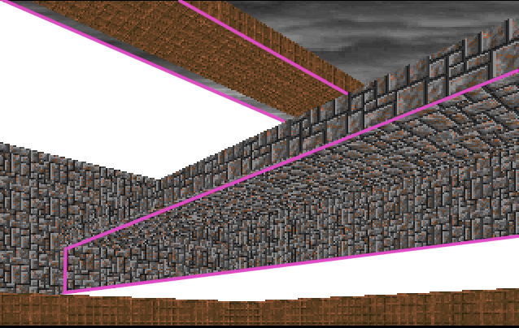
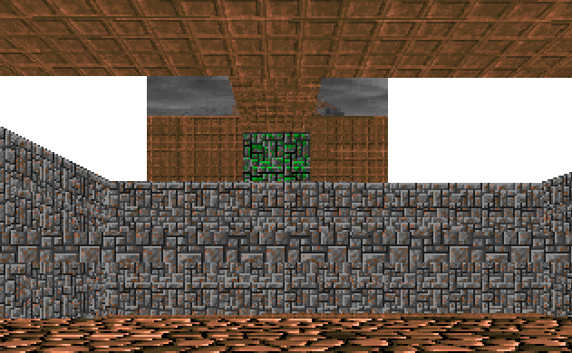

# **Capítulo 8.** Sector over Sector. Stack Wall. Flat Portal
> *Código fuente*: [Source](./src) 

Una de las limitaciones del *Doom Engine* y del *Build Engine* es el problema conocido como **Room over Room**. El mismo consiste en que es imposible colocar un Sector encima de otro debido a las limitaciones de renderización del motor. Por medio de trucos se puede llegar a simular el efecto en el Doom Engine. Además, las nuevas versiones de [mapster32](https://wiki.eduke32.com/wiki/Mapster32) garantizan el TROR (True Room Over Room).\
Pero estas mejoras tienen una restricción importante: en la renderización solo se puede ver uno de los sectores apilados. En este capítulo vamos a estudiar dos soluciones para dibujar un sector encima del otro dentro de la misma columna: **Stack Wall** y **Flat Portal**.

## Stack Wall
Hasta el momento, tenemos dos tipos de walls definidas: la *Solid Wall* y el *Portal*. Este último es el que nos garantiza ver en una columna el sector adyacente. Si pudiéramos mostrar más de un portal en una misma columna podríamos ver un sector encima del otro. En esta idea se basa la **Stack Wall**, un tipo de wall que permite apilar Portals o Solid Walls.\
A las walls contenidas en el stack se las denomina **subwalls** para diferenciarlas de las walls tradicionales. Una subwall tiene una componente adicional **z**, es la distancia desde el suelo hasta el límite superior de la subwall. La siguiente figura presenta la estructura básica del stack:



La última componente z (zn) es ignorada debido a que va a coincidir con el techo.
### Definición
La estructura es similar a Portal y a Solid Wall.
```javascript
const Stack = () => ({
    isStack: true, // Para diferenciarlo de los demás tipos
    walls: [],     // Stack de walls
  
    clipping() {
        for (const wall of this.wall)
            wall.clipping()
    },

    draw(viewport) {
		for (const wall of this.walls)
            Dibujar wall
    }
})
```
### Diseño, Parser y Linker
En el archivo de diseño un Stack se diferencia por tener un campo **walls**. Este campo, es un arreglo de *Subwalls*. Toda subwall necesita especificar su campo *z*, excepto la última. En `toml`, por ejemplo, se especifica de la siguiente manera:
```toml
[[sectors]]
    . . .

    [[sectors.loops]]
        name = "border"
        v = [16,25, 3,25, 3,20, 16,20]
        walls = [
            {texture = "stone"},
            {texture = "stone"},
            
#           --- Definición de Stack Wall ---
            {walls = [
                {texture = "stone", next = "below", z = 2},
                {texture = "mossy", next = "above"}
            ]},
            
            {texture = "stone"}
        ]

```
Para extraer la información del archivo de diseño, recurrimos al Parser donde diferenciamos al Stack por tener el campo *walls* en su definición:
```javascript
const Parser = {
    . . .
    parseWall(info) {
        let wall;

        if (info.walls) {
            wall = Stack()

            for (const subinfo of info.walls) {
                const subwall = this.parseWall(subinfo)
                wall.walls.push(subwall)
                subwall.z = subinfo.z
            }
        } else if (info.next) {
        . . .
    },
    . . .
}
```
Por último actualizamos el linker:
```javascript
const Linker = {
    . . .
    linkSector(sector, level) {
        for (const segment of sector.segments) {
            if (segment.wall.isPortal)
                this.linkPortal(segment.wall, level)
            else if (segment.wall.isStack)
                this.linkStack(segment.wall, level)
            else
                this.linkWall(segment.wall)
            segment.sector = sector
        }
        . . .
    },
    . . .
    linkStack(wall, level) {
        for (const subwall of wall.walls) {
            if (subwall.isPortal)
                this.linkPortal(subwall, level)
            else
                this.linkWall(subwall)

            subwall.segment = wall.segment
        }
    },
}
```
### Renderización
Primero, en la etapa de proyección del Sector, se deben liberar todos los viewports asignados a los Portal del Stack:
```javascript
const Sector = (name) => ({
    . . .
    project() {
        . . .
        for (const s of this.segments) {
            . . .
            if (s.wall.isPortal && s.wall.viewport) {
                s.wall.viewport = null
            } else if (s.wall.isStack) {
                for (const subwall of s.wall.walls)
                    if (subwall.isPortal)
                        subwall.viewport = null
            }
        }
    }
})
```
Ahora, pasamos a completar la función `draw` del Stack. Es bastante simple, ya que proyecta el segment asociado al Screen Space de acuerdo a la ubiación vertical de la subwall. Luego, envía a dibujar la subwall en ese marco:
```javascript
const Stack = () => ({
    . . .
    draw(viewport) {
        let z = 0
        const floor = viewport.sector.floor.z
        const ceil = viewport.sector.ceiling.z
		for (const wall of this.walls) {
            wall.segment.toScreenSpace(floor + wall.z || ceil, floor + z)
			wall.draw(viewport)

			z = wall.z
		}
  	  this.segment.toScreenSpace(ceil, floor) // Volvemos a la proyección inicial
    }
})
```
### Cross Stack
Para permitir que la cámara pueda atravesar los Portals de un Stack, debemos actualizar la función `checkCrossPortal` del Player:
```javascript
const Player = {
    . . .
    checkCrossPortal() {
        for (const s of this.sector.segments) {
            if (s.isVectorCrossing(this.last.x, this.last.y, Camera.pos.x, Camera.pos.y)) {
                if (s.wall.isPortal) {
                    this.sector = Renderer.MainViewport.sector = s.wall.next
                    break
                } else if (s.wall.isStack) {
                    for (const subwall of s.wall.walls) {
                        if (subwall.isPortal && (this.sector.floor.z + subwall.z || this.sector.ceiling.z) > Camera.pos.z) {
                            this.sector = Renderer.MainViewport.sector = subwall.next
                            break
                        }
                    }
                }
            }
        }
    }
}
```
## Flat Portal
Esta técnica aprovecha lo aprendido hasta ahora para convertir un Flat en un Portal. Consiste, simplemente, en dibujar otro sector en vez de dibujar la textura del techo o del suelo.\
Para definir un Flat Portal necesitamos dos sectores, uno por encima del otro y deben coincidir en el contorno de su forma. En cada uno de esos sectores podemos tener subsectores (sectores internos) y necesitamos que todos referencien al mismo Portal. Como cada sector tiene su propio Flat, vamos a necesitar una nueva estructura para que compartan información: la `Interface` que va a tener referencia a los dos Sectores que divide. Adicionalmente, mantiene una lista de los sectores que tiene encima y los sectores que tiene debajo.
```javascript
const Interface = (upSector, downSector) => ({
	up: [],
	down: [],
	
	upSector,
	downSector,
	
	addUp(flat) {
		this.up.push(flat)
	},
	
	addDown(flat) {
		this.down.push(flat)
	}
}
```
### Diseño, Parser y Linker
Para especificar un Flat Portal, empezamos  definiendo las propiedades en la etapa de diseño. La clave está en el campo *next* del floor o del ceiling. Esto lo convierte en un Flat Portal. El valor de *next* van a ser el nombre del sector de arriba y el de abajo, separados por un guión `-`. Ejemplo:
```javascript
[[sectors]]
    name = "other"

    [sectors.ceiling]
    z = 3
    next = "top-other"
```
Según ese fragmento, el sector "other" tiene un Portal en su ceiling que divide a top de other. Este valor de next se va convertir en una *Interface*.\

En el Parser refactorizamos y agregamos la componente "next". También vamos a necesitar agregar un nuevo campo a la estructura del *level*: `interfaces` que va a contener todas las interfaces del nivel indexadas por nombre.
```javascript
const Parser = {
    parseLevel(info) {
        const level = {sectors: {}, interfaces: {}}
		. . .
    },

    parseFloor(info) {
        const floor = Floor()

        this.parseFlat(floor, info)

        return floor
    },

    parseCeiling(info) {
        const ceil = Ceiling()

        this.parseFlat(ceil, info)

        return ceil
    },
  
    parseFlat(flat, info) {
        flat.z = isNaN(info.z) ? 0 : info.z

        if (info.texture) {
            flat.texture = this.parseTexture(info.texture)
            flat.isRelative = !!info.isRelative
            flat.parallax = !!info.parallax
        }

        if (info.next) flat.next = info.next
    },
}
```

Por último en el Linker debemos crear la Interface, asignarla a todos los flats que la referencien.
```javascript
const Linker = {
    linkSector(sector, level) {
        . . .		
		this.linkFlat(sector.floor,   level, false)
        this.linkFlat(sector.ceiling, level, true)

        sector.floor.sector = sector.ceiling.sector = sector
    },
  
    linkFlat(flat, level, ceiling = true) {
        if (flat.next) {
            if (!level.interfaces[flat.next])
				level.interfaces[flat.next] = Interface(...flat.next.split("-").map(s => level.sectors[s]))
			
			const interface = level.interfaces[flat.next]
			interface[ceiling ? "addDown" : "addUp"](flat)
			flat.interface = interface
			flat.next = ceiling ? interface.upSector : interface.downSector
        } else
            this.linkTexture(flat.texture)
    },

}
```

Ahora el campo *next* del Flat apunta a un Sector y la interface está referenciada en el campo *interface* del Flat.
### Renderización
Tanto en Ceiling como Floor deben multiplexar el dibujo dependiendo de su tipo:
```javascript
const Ceiling/Floor = () => ({
    . . .
    draw(to, viewport) {
        . . .
        if (this.next)
            this.drawNext(viewport)
        else if (this.parallax)
            this.drawParallax(viewport)
        else
            this.drawFlat(viewport)
    },
    . . .
})
```
Y en `Flat` agregamos la nueva función para dibujar el Flat Portal. Intuitivamente, la función es similar a la del Portal convencional.
```javascript
const Flat = {
    . . .
    loadViewport() {
        this.viewport = ViewportsPool.take()
        this.viewport.sector = this.next
		this.viewport.segment = null
        this.viewport.project()
    },

    drawNext(viewport) {
        if (!this.viewport) this.loadViewport()

        this.viewport.top    = Math.max(viewport.top,    this.y0)
        this.viewport.bottom = Math.min(viewport.bottom, this.y1)
        this.viewport.x = viewport.x
        Renderer.stackViewport(this.viewport)
    }
}
```
Para garantizar que los Flat Portal se dibujen antes que los Portal convencionales, debemos cambiar el orden de renderizado en `Viewport`:
```javascript
const Viewport = (width) => ({
  draw() {
        const segment = this.closest[this.x]
        if (segment) {
			// Wall
            segment.wall.draw(this)

			// Flats
			if (Camera.pos.z < segment.sector.ceiling.z)
				segment.sector.ceiling.draw(segment.getTopAt(this.x), this)
			if (Camera.pos.z > segment.sector.floor.z)
				segment.sector.floor.draw(segment.getBottomAt(this.x), this)
        }
    }
})
```
Por último debemos eliminar el viewport de los flats en la etapa de proyección del Sector:
```javascript
const Sector = (name) => ({
    . . .
    project() {
        . . .
        for (const s of this.segments) {
            . . .
            if (this.floor.next)   this.floor.viewport   = null
            if (this.ceiling.next) this.ceiling.viewport = null
        }
    }
})
```
### Extensiones
Si intenta graficar con el motor actual va surgir un error visual cuando se cruzan un Flat Portal con un Portal, el cual se ve similar a:



En la imagen se puede ver el contorno de los portales, pintado de magenta, y por debajo, un área pintada de blanco: el error visual.\
Su origen se debe a que en la proyección del segment, la pared termina donde termina el floor (o el ceiling) y por debajo (o por encima) no hay nada que dibujar.\
Para solucionarlo, debemos **extender** el Portal hasta el límite de la pantalla, únicamente cuando estemos fuera de los límites del Sector. Entonces, en Viewport agregamos:
```javascript
const Viewport = (width) => ({
  draw() {
        const segment = this.closest[this.x]
        if (segment) {
			// Wall
            ...
			// Flats
			...
            // Extension
			if (Camera.pos.z > segment.sector.ceiling.z)
				segment.wall.extendUp(this)
			if (Camera.pos.z < segment.sector.floor.z)
				segment.wall.extendDown(this)
        }
    }
})
```
De esta forma, para cada tipo de Wall creamos ambas funciones.\
Lógicamente, para la Solid Wall no hacemos nada:
```javascript
const Wall = () => ({
    . . .
    extendUp(viewport) {
	},
	
	extendDown(viewport) {
	}
})
```
Para el Portal, extendemos los valores de oclusión del Viewport:
```javascript
const Portal = () => ({
    . . .
    extendUp(viewport) {
		if (this.next.ceiling.z >= viewport.sector.ceiling.z) // Si no hay Step Down
			this.viewport.top = viewport.top
	},
	
	extendDown(viewport) {
		if (this.next.floor.z <= viewport.sector.floor.z) // Si no hay Step Up
			this.viewport.bottom = viewport.bottom
	}
})
```
El Stack, únicamente llama a la extensión de sus walls ubicadas en los extremos:
```javascript
const Stack = () => ({
    . . .
    extendUp(viewport) {
        this.walls[this.walls.length - 1].extendUp(viewport)
	},
	
	extendDown(viewport) {
        this.walls[0].extendDown(viewport)
	}
})
```
Y con ese arreglo ya debería ser posible ver el nivel sin errores gráficos.
### Cross Flat Portal
Antes de pasar a programar la lógica para cruzar un Flat Portal, debemos refactorizar el código en `Player`.
```javascript
const Player = {
    . . .
    checkCrossPortal() {
        const nextSector = this.getCrossedInSector(this.sector)
		this.sector = Renderer.MainViewport.sector = nextSector
    },
    
    getCrossedInSector(sector) {
		for (const s of sector.segments) {
            if (s.isVectorCrossing(this.last.x, this.last.y, Camera.pos.x, Camera.pos.y)) {
                if (s.wall.isPortal) {
					return s.wall.next
                } else if (s.wall.isStack) {
                    for (const subwall of s.wall.walls) {
                        if ((sector.floor.z + subwall.z || Infinity) > Camera.pos.z && subwall.isPortal) {
							return subwall.next
                        }
                    }
                }
            }
        }
		return sector
	}
}
```
De esta forma, Player puede saber si atravesó algún Portal de un determinado Sector. Esto es realmente importante, puesto que el jugador puede estar cruzando Portales de un Sector que está encima o debajo. Si estos cruces no se tienen en cuenta, pueden causar errores gráficos.\
Para llevar el control de estos cambios empleamos a `Interface`, a la que le añadimos la propiedad de cambiar el campo *next* de los Flats que tiene encima o debajo:
```javascript
const Interface = (upSector, downSector) => ({
    . . .
    updateUpSector(sector) {
		for (const f of this.down)
			f.next = sector
	},
	
	updateDownSector(sector) {
		for (const f of this.up)
			f.next = sector
	},
})
```
Con estas funciones ya podemos completar nuestra función checkCrossPortal del Player:
```javascript
const Player = {
    . . .
    checkCrossPortal() {
        const nextSector = this.getCrossedInSector(this.sector)
		this.sector = Renderer.MainViewport.sector = nextSector
      
      if (this.sector.ceiling.next) {
			if (Camera.pos.z > this.sector.ceiling.z) { // Traspasé el ceiling
				// Como desde un único Flat se pueden ir a varios Sector dependiendo el movimiento,
				// tengo que garantizar que puedo volver por el lugar donde vine, por eso es necesaria
				// la siguiente línea
				this.sector.ceiling.next.floor.next = this.sector // Garantizo la ida y la vuelta
				this.sector = Renderer.MainViewport.sector = this.sector.ceiling.next
			} else {
                // Verifico si crucé algún Portal en el Sector de arriba
				const upSector = this.getCrossedInSector(this.sector.ceiling.next)
                if (upSector !== this.sector.ceiling.next)
                    this.sector.ceiling.interface.updateUpSector(upSector)
			}
        }

        if (this.sector.floor.next) {
			if (Camera.pos.z < this.sector.floor.z) { // Traspasé el floor
				this.sector.floor.next.ceiling.next = this.sector
				this.sector = Renderer.MainViewport.sector = this.sector.floor.next
			} else {
                // Verifico si crucé algún Portal en el Sector de abajo
				const downSector = this.getCrossedInSector(this.sector.floor.next)
                if (downSector !== this.sector.floor.next)
                    this.sector.floor.interface.updateDownSector(downSector)
			}
        }
    }
}
```
Con la función ya actualizada, el jugador puede pasar de un sector a otro verticalmente.
### Reset
Aun queda resolver un último error visual que ocurre cuando el Jugador se retira de la zona de interfaz, desde un subsector:



La Interface sigue pensando que estamos en el subsector llamado `beam`, pero debería estar en el sector `top`.\
La solución consiste en detectar si abandonamos los límites del sector mayor y reinciar la Interface a sus valores por defecto. En Interface agregamos la función `reset`:
```javascript
const Interface = (upSector, downSector) => ({
    . . .
    reset() {
		this.updateUpSector(upSector)
		this.updateDownSector(downSector)
	}
})
```
Y al detección del cruce la realizamos en Player:
```javascript
const Player = {
    checkCrossPortal() {
        const nextSector = this.getCrossedInSector(this.sector)
        if (this.sector.ceiling.interface && nextSector.ceiling.interface !== this.sector.ceiling.interface)
            this.sector.ceiling.interface.reset()
        if (this.sector.floor.interface && nextSector.floor.interface !== this.sector.floor.interface)
            this.sector.floor.interface.reset()
		this.sector = Renderer.MainViewport.sector = nextSector
        . . .
    }
}
```
## Conclusión
La incorporación de las técnicas de **Wall Stack** y **Flat Sector** dotan al Engine de una cualidad que carecen tanto el Build Engine como el Doom Engine: visualizar dos Sectores, uno por encima de otro.\
Este efecto permite la construcción de estructuras que son imposibles en dichos motores: mesas, balcones de edificios, puentes, plataformas flotantes, etc.\
En el próximo capítulo exploraremos la última estructura sólida de un nivel: el **Slope**, con la cual podremos visualizar correctamente los mapas del Build Engine.