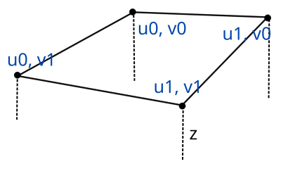

# **Capítulo 9.** Slopes
> *Código fuente*: [Source](./src) 

Una de las cualidades que brindaba el Build Engine, era su capacidad de dibujar superficies inclinadas un cierto ángulo. Esto permitía crear rampas y rompía con la ortogonalidad propia de las paredes y los flats. A estas estructuras las llamamos **slopes** y componen la última pieza del diesño del nivel.\
Gráficamente, el Slope está compuesto por dos partes: el **slope** propiamente dicho y la **sidewall**. Ambas partes pueden verse en la siguiente figura:


Como se puede observar, las sidewalls son ortogonales al suelo.\
Se puede entender a un Slope como un Flat inclinado. Entonces lo que define su forma es el contorno del Sector donde se encuentra.\
Si el Slope parte del techo decimos que es un **Slope Ceil** y si parte del suelo es un **Slope Floor**.
## Definición
La estructura de `Slope` es la siguiente:
```javascript
const Slope = () => ({
    project() {
    }
})
```
A su vez existen dos prototipos que heredan de Slope: `SlopeFloor` y `SlopeCeil` que se van a encargar de dibujar:
```javascript
const SlopeFloor = () => ({
    draw(viewport) {
    },
    __proto__: Slope
})
```
```javascript
const SlopeCeil = () => ({
    draw(viewport) {
    },
    __proto__: Slope
})
```
## Diseño
En el archivo de diseño indicamos que existe un slopeFloor y un slopeCeil que requiere los siguientes parámetros:
- **z**: es un arreglo de valores. Cada valor corresponde a la cordenada Z del vértice en el border loop. Si es un slopeFloor, indica qué tanto se eleva respecto del suelo. En el caso del slopeCeil indica que tanto desciende respecto del techo. 
- **sidewall**: es el nombre de la textura con la que se debe dibujar el sidewall.
- **isRelative**: si es true, entonces el sidewall se ve afectado por el ángulo de inclinación del slope. Esto es útil para dar un efecto realista a rampas que se mueven.

Tenga en cuenta que es necesario que el Sector tenga un loop cuyo nombre sea "border" para definir la forma del Slope.\
La textura del Slope va ser la misma que se asigne a su Flat correspondiente. Como tenemos varios vértices que componen el slope, debemos asignarles las coordenadas U y V de la textura:



### Parser
Agregamos en parseSector la posibilidad de leer los slopes y creamos su respectivo parser:
```javascript
const Parser = {
    parseSector(name, info) {
        . . . 
        if (info.slopeFloor) sector.slopeFloor = this.parseSlope(info.slopeFloor, info.loops.border.v, sector.floor.texture, true)
        if (info.slopeCeil)  sector.slopeCeil  = this.parseSlope(info.slopeCeil,  info.loops.border.v, sector.ceiling.texture)

        return sector
    },
    . . .
    parseSlope(info, vertices, texture, isFloor = false) {
        const slope = isFloor ? SlopeFloor() : SlopeCeil()

        slope.texture = texture
        slope.sidewall = this.parseTexture(info.sidewall)
        slope.isRelative = !!info.isRelative

        slope.segments = info.z.map((z, i) => {
            const segment = Segment(
                vertices[i * 2], vertices[i * 2 + 1],
                vertices[(i * 2 + 2) % vertices.length], vertices[(i * 2 + 3) % vertices.length]
            )
            segment.p0.z = z
            segment.p1.z = info.z[(i + 1) % info.z.length]

            return segment
        })

        return slope
    }
}
```
Como puede observarse en el fragmento, para almacenar la forma del slope, creamos un arreglo `segments` y asignamos a sus vértices los valores de Z definidos por el slope.
### Linker
En Link sector debemos seleccionar si vamos a tener un Flat o un Slope en su lugar. Adicionalmente, creamos su Linker: 
```javascript
onst Linker = {
    . . .
    linkSector(sector, level) {
        . . .
        if (sector.slopeFloor) {
            this.linkSlope(sector.slopeFloor)
            sector.slopeFloor.sector = sector
        } else {
            this.linkFlat(sector.floor, level, false)
            sector.floor.sector = sector
        }

        if (sector.slopeCeil) {
            this.linkSlope(sector.slopeCeil)
            sector.slopeCeil.sector = sector
        } else {
            this.linkFlat(sector.ceiling, level, true)
            sector.ceiling.sector = sector
        }
    },
    . . .
    linkSlope(slope) {
        this.linkTexture(slope.texture)

        TextureLoader.getTexture(slope.texture.name, texture => {
            slope.texture.data = texture.data
            slope.texture.h    = texture.h
            slope.texture.w    = texture.w

            const p0 = slope.segments[0].p0
            // Asignación de U y V respecto al primer vértice (p0)
            for (const segment of slope.segments) {
                segment.p0.u = slope.texture.offU + slope.texture.w * (segment.p0.x - p0.x) / slope.texture.scaleU
                segment.p1.u = slope.texture.offU + slope.texture.w * (segment.p1.x - p0.x) / slope.texture.scaleU
                segment.p0.v = slope.texture.offV + slope.texture.h * (segment.p0.y - p0.y) / slope.texture.scaleV
                segment.p1.v = slope.texture.offV + slope.texture.h * (segment.p1.y - p0.y) / slope.texture.scaleV
            }
        })

        this.linkTexture(slope.sidewall)
    }
}
```
De esta forma, el slope tiene una referencia de su sector.
## Renderización
### Slope
Para la renderización de la slope nos vamos a basar en la técnica de Rasterización con *Perspective Correct Projection*. Una buena explicación la podemos encontrar en el video [Texture Mapping & Polygon Rasterizing Tutorial (2/2) [C++20]](https://www.youtube.com/watch?v=hxOw_p0kLfI) de Bisqwit.\
La rasterización del slope ocurre entre dos límites definidos por los segments del slope: **upper** y **lower**. Dentro de esa área dibujaremos la textura con la perspectiva correcta. La idea se simplifica en la siguiente imagen:


Note que los segments correspondiente al límite superior van de izquierda a derecha y los del inferior de derecha a izquierda.\
Idealmente, los límites se pueden obtener directamente a partir de los segments. Lamentablemente, esto no ocurre así. Dependiendo de la posición de la cámara los segments pueden ser recortados por el Near Plane Culling e incluso pueden quedar detrás del plano dejando al límite inferior sin segments. La siguiente imagen represetna el problema:


En la figura se puede ver en azul, el segment que se debe crear entre los vértices. Si consideramos que vamos a trabajar con un segment a la vez entre cada par de vértices, entonces para definir al límite inferior (*lower*) solo necesitamos los vértices.\
Con esta consideración, definimos un arreglo de segments llamado **back** que define el upper limit y un arreglo de Points llamado **fore** desde los cuales vamos a crear los segments para el lower limit.\
En Slope proyectamos los segments y los ubicamos dentro de losarreglos:
```javascript
const Slope = {
    project() {
        this.back.length = this.fore.length = 0
        for (const s of this.segments) {
            if (s.toDepthSpace(true)) {
                this.projectSegment(s)
                this.toScreenSpace(s)
            }
        }
    },

}
```
En SlopeFloor y SlopeCeil agregamos los arreglos y agregamos la función para proyectar en Screen Space un determinado segment:
```javascript
const SlopeFloor = () => ({
    back: [],
    fore: [],
    
    toScreenSpace(segment) {
        const z = this.sector.floor.z
        segment.p0.toScreenSpace(z + segment.p0.z0, z)
        segment.p1.toScreenSpace(z + segment.p1.z0, z)
    }
})
```
```javascript
const SlopeCeil = () => ({
    back: [],
    fore: [],
    
    toScreenSpace(segment) {
        const z = this.sector.ceiling.z
        segment.p0.toScreenSpace(z, z - segment.p0.z0)
        segment.p1.toScreenSpace(z, z - segment.p1.z0)
    }
})
```
Note que en el llamado a toDepthSpace pasamos como parámetro true. Esto es para facilitar un byPass en Segment y que nos permita ver segments que no están orientados hacia la cámara. Entonces en `Segment` agregamos:
```javascript
const Segment = (x0, y0, x1, y1) => ({
    . . .
    toDepthSpace(byPass = false) {
        . . .
        return (this.p0.col < Renderer.width) &&
               (this.p1.col >= 0) &&
               (this.p0.col < this.p1.col) || byPass
    }
    . . .
})
```
#### Buffers
Para reducir la carga al momento de dibujar, la información de los límites la vamos a contener en buffers. De forma similar a al ViewportsPool, vamos a crear un `BufferPool` que permita la asignacion dinámica:
```javascript
const BufferPool = {
    length: 0,

    init() {
        this.buffers = new Array(32).fill(0).map(_ => ({
            upper: {
                y: new Float32Array(Renderer.width)
            },

            lower: {
                y: new Float32Array(Renderer.width)
            },

            segment: Segment(0,0,0,0) // Segment a ser usado para el límite inferior
        }))
    },
    
    take() {
        return this.buffers[this.length++]
    },

    clear() {
        this.length = 0
    }
}
```
En `main` lo inicializamos:
```javascript
. . .
ViewportsPool.init()
BufferPool.init()
. . .
```
Y en `Renderer` lo limpiamos:
```javascript
const Renderer = {
    . . .
    draw() {
        . . .
        ViewportsPool.clear()
        BufferPool.clear()
    },
    . . .
}
```
Para adquirirlo, en la función project del Slope:
```javascript
const Slope = {
    project() {
        this.buffers = BufferPool.take()
        . . .
    }
    . . .
}
```
#### Fill Buffers
El arreglo **y** de upper y lower lo vamos a completar con la interpolación de bottom o top del segment, según corresponda. Para facilitar la tarea, creamos dos funciones en Segment que reciben un buffer como parámetro:
```javascript
const Segment = (x0, y0, x1, y1) => ({
    . . .
    fillTop(top) {
        const dt = (this.p1.top - this.p0.top) / (this.p1.col - this.p0.col)
        let from = Math.max(0, ~~(this.p0.col + 1)),
            to   = Math.min(Renderer.width-1, ~~this.p1.col)

        let t = (from - this.p0.col) * dt + this.p0.top
        for (let c = from; c <= to; c++, t+=dt)
            top[c] = t
    },

    fillBottom(bottom) {
        const db = (this.p1.bottom - this.p0.bottom) / (this.p1.col - this.p0.col)
        let from = Math.max(0, ~~(this.p0.col + 1)),
            to   = Math.min(Renderer.width-1, ~~this.p1.col)

        let b = (from - this.p0.col) * db + this.p0.bottom
        for (let c = from; c <= to; c++, b+=db)
            bottom[c] = b
    },
    . . .
})
```
Ahora ya podemos completar los buffers de los límites con la proyección de los Segments y así pintar el área donde está ubicado el slope:
```javascript
const Slope = {
    project() {
        . . .
        this.projectBack()
        this.projectFore()
    },
  
    drawSlope(viewport) {
        const x = viewport.x,
              top = this.buffers.upper.y[x]

        for (let y = Math.max(viewport.top, ~~top), b = Math.min(viewport.bottom, this.buffers.lower.y[x]); y <= b; y++) {
            const Y = y << 2

            Renderer.column[Y]   = 255
            Renderer.column[Y+1] = 128
            Renderer.column[Y+2] = 0
        }
    }
}
```
```javascript
const SlopeFloor = () => ({
    . . .
    projectBack() {
        for (const far of this.back) {
            far.fillTop(this.buffers.upper.y)
        }
    },

    projectFore() {
        const segment = this.buffers.segment

        for (let i = 0, len = this.fore.length; i < len; i++) {
            segment.p1 = this.fore[i]
            segment.p0 = this.fore[(i+1) % len]

            segment.fillTop(this.buffers.lower.y)
        }
    },

    . . .

    draw(viewport) {
        const top = this.buffers.upper.y[viewport.x],
            bottom = this.buffers.lower.y[viewport.x]

        // Slope
        if (top <= bottom)
            this.drawSlope(viewport)
        
        viewport.bottom = Math.min(viewport.bottom, Math.min(top, bottom))
    },
    . . .
})
```
```javascript
const SlopeCeil = () => ({
    . . .
    projectBack() {
        for (const far of this.back) {
            far.fillBottom(this.buffers.lower.y)
        }
    },

    projectFore() {
        const segment = this.buffers.segment

        for (let i = 0, len = this.fore.length; i < len; i++) {
            segment.p1 = this.fore[i]
            segment.p0 = this.fore[(i+1) % len]

            segment.fillBottom(this.buffers.upper.y)
        }
    },

    . . .

    draw(viewport) {
        const top = this.buffers.upper.y[viewport.x],
            bottom = this.buffers.lower.y[viewport.x]

        // Slope
        if (top <= bottom)
            this.drawSlope(viewport)

        viewport.top = ~~Math.max(viewport.top, Math.max(0, top + 1, bottom + 1))
    },
    . . .
})

```
#### Enviar a Dibujar
En Sector llamamos a la proyección de los slopes
```javascript
const Sector = (name) => ({
    . . .
    project() {
        . . .
        if (this.slopeFloor) this.slopeFloor.project()
        if (this.slopeCeil)  this.slopeCeil.project()
    }
})
```
En Viewport enviamos a dibujar los slopes en un orden que depende la posición de la cámara. Por otro lado, cancelamos la renderización del Flat si hay un Slope en su lugar:
```javascript
const Viewport = (width) => ({
    . . .
    draw() {
        const segment = this.closest[this.x]
        if (segment) {
            const floorBefore = (Camera.pos.z - this.sector.floor.z) < (this.sector.ceiling.z - Camera.pos.z)

            floorBefore && this.sector.slopeFloor && this.sector.slopeFloor.draw(this)
                           this.sector.slopeCeil  && this.sector.slopeCeil.draw(this)
            !floorBefore && this.sector.slopeFloor && this.sector.slopeFloor.draw(this)

			// Wall
            segment.wall.draw(this)

			// Flats
			if (Camera.pos.z < segment.sector.ceiling.z && !this.sector.slopeCeil)
				segment.sector.ceiling.draw(segment.getTopAt(this.x), this)
			if (Camera.pos.z > segment.sector.floor.z && !this.sector.slopeFloor)
				segment.sector.floor.draw(segment.getBottomAt(this.x), this)
			. . .
        }
    }
})

```
#### Textura
El color está muy bien pero sería más interesante mostrar una textura. Partimos entonces desde la función donde se dibuja el slope, el drawSlope:
```javascript
const Slope = {
    . . .
    drawSlope(viewport) {
        const x = viewport.x,
              top = this.buffers.upper.y[x]

        const dyinv = 1 / (this.buffers.lower.y[x] - top)

        const zinv = this.buffers.upper.zinv[x],
              uinv = this.buffers.upper.uinv[x],
              vinv = this.buffers.upper.vinv[x]

        const deltaZinv = (this.buffers.lower.zinv[x] - zinv) * dyinv,
              deltaUinv = (this.buffers.lower.uinv[x] - uinv) * dyinv,
              deltaVinv = (this.buffers.lower.vinv[x] - vinv) * dyinv

        const texture = this.texture

        for (let y = Math.max(viewport.top, ~~top), b = Math.min(viewport.bottom, this.buffers.lower.y[x]); y <= b; y++) {
            const z = 1 / (zinv + deltaZinv * (y - top))
            const u = z * (uinv + deltaUinv * (y - top))
            const v = z * (vinv + deltaVinv * (y - top))
            const Y = y << 2
            const tindex = (texture.h * (u & (texture.w - 1)) + (v & (texture.h - 1))) << 2

            Renderer.column[Y]   = texture.data[tindex]
            Renderer.column[Y+1] = texture.data[tindex + 1]
            Renderer.column[Y+2] = texture.data[tindex + 2]
        }
    },

}
```
La función simplemente realiza la interpolación lineal entre los valores del upper limit y el lower limit, teniendo en cuenta la coreeción de perspectiva. Si se fija, necesitamos tres buffers adicionales: zinv, uinv y vinv que tendrán los valores 1/z, 1/u y 1/v respectivamente.\
Añadimos los buffers al Pool:
```javascript
const BufferPool = {
    length: 0,

    init() {
        this.buffers = new Array(32).fill(0).map(_ => ({
            upper: {
                y: new Float32Array(Renderer.width),
                zinv: new Float64Array(Renderer.width),
                uinv: new Float64Array(Renderer.width),
                vinv: new Float64Array(Renderer.width)
            },

            lower: {
                y: new Float32Array(Renderer.width),
                zinv: new Float64Array(Renderer.width),
                uinv: new Float64Array(Renderer.width),
                vinv: new Float64Array(Renderer.width)
            },
        }))
    },
    . . .
}
```
Para completar esos buffers vamos a crear la función *fillBuffer* en Slope. Esta se va a encargar de hacer una interpolación lineal de los valores entre los extremos de un determinado Segment y los escribe en el buffer correspondiente. Adicionalmente, en *projectSegment* agregamos los valores U y V a cada vértice.
```javascript
const Slope = {
    . . .
    projectSegment(s) {
        . . .
        // Clipping
        s.p0.u0 = s.p0.u + s.p0.l * (s.p1.u - s.p0.u)
        s.p0.v0 = s.p0.v + s.p0.l * (s.p1.v - s.p0.v)
        s.p1.u0 = s.p0.u + s.p1.l * (s.p1.u - s.p0.u)
        s.p1.v0 = s.p0.v + s.p1.l * (s.p1.v - s.p0.v)
    },

    fillBuffer(segment, buffer) {
        const {p0, p1} = segment

        const dx = 1 / (p1.col - p0.col)
        const dzinv = (p1.depth - p0.depth) * dx,
              duinv = (p1.u0 * p1.depth - p0.u0 * p0.depth) * dx,
              dvinv = (p1.v0 * p1.depth - p0.v0 * p0.depth) * dx
        let from = Math.max(0, ~~(p0.col + 1)),
            to   = Math.min(Renderer.width-1, ~~p1.col)

        let zinv = (from - p0.col) * dzinv + p0.depth,
            uinv = (from - p0.col) * duinv + p0.u0 * p0.depth,
            vinv = (from - p0.col) * dvinv + p0.v0 * p0.depth

        for (let c = from; c <= to; c++) {
            buffer.zinv[c] = zinv
            buffer.uinv[c] = uinv
            buffer.vinv[c] = vinv

            zinv += dzinv
            uinv += duinv
            vinv += dvinv
        }
    },
    . . .
}
```
Lo que sigue es llamar a esta función en los Slopes correspondientes:
```javascript
const SlopeFloor = () => ({
    . . .
    projectBack() {
        for (const far of this.back) {
            far.fillTop(this.buffers.upper.y)
            this.fillBuffer(far, this.buffers.upper)
        }
    },

    projectFore() {
        const segment = this.buffers.segment

        for (let i = 0, len = this.fore.length; i < len; i++) {
            . . .
            this.fillBuffer(segment, this.buffers.lower)
        }
    },
    . . .
})
```
```javascript
const SlopeCeil = () => ({
    . . .
    projectBack() {
        for (const far of this.back) {
            far.fillBottom(this.buffers.lower.y)
            this.fillBuffer(far, this.buffers.lower)
        }
    },

    projectFore() {
        const segment = this.buffers.segment

        for (let i = 0, len = this.fore.length; i < len; i++) {
            . . .
            this.fillBuffer(segment, this.buffers.upper)
        }
    },
    . . .
})
```
### Sidewall
Se puede pensar en una sidewall como una Solid Wall cuyos límites se encuentran recortados por el Slope. Como no tenemos una wall anexada a los segments, vamos a escribir la información de la textura y su límite dentro de un buffer.\
Partimos de la función que dibuja la sidewall, drawSidewall en Slope:
```javascript
const Slope = {
    . . .
    drawSidewall(top, bottom, v0, v1, viewport) {
        const texture = this.sidewall
        const u = this.buffers.side.u[viewport.x]
        const deltaV = (v1 - v0) / (bottom - top)
        for (let y = Math.max(viewport.top, ~~top), b = Math.min(viewport.bottom, bottom); y <= b; y++) {
            const v = v0 + deltaV * (y - top)
            const Y = y << 2
            const tindex = (texture.h * u + (v & (texture.h - 1))) << 2

            Renderer.column[Y]   = texture.data[tindex]
            Renderer.column[Y+1] = texture.data[tindex+1]
            Renderer.column[Y+2] = texture.data[tindex+2]
        }
    }
}
```
Como puede verse partimos de un punto `top` hacia un `bottom` haciendo una interpolación lineal de V a lo largo de esta columna (partimos de v0 y terminamos en v1). El valor de U lo obtenemos del buffer.\
Esta función va a ser llamada por los Slopes, desde donde se calcula v0 y v1 tomando el valor de z del buffer:
```javascript
const SlopeFloor = () => ({
    . . .
    draw(viewport) {
        . . .        
        // Sidewall
        if (bottom < viewport.bottom) {
            const z = this.buffers.side.z[viewport.x]
            const v0 =  this.isRelative ? 0 :  z * this.sidewall.h,
                  v1 = !this.isRelative ? 0 : -z * this.sidewall.h
            this.drawSidewall(bottom, this.buffers.side.y[viewport.x], v0, v1, viewport)
        }
        . . . 
    },
    . . . 
})
```
```javascript
const SlopeCeil = () => ({
    . . .
    draw(viewport) {
        . . .        
        // Sidewall
        if (~~top > viewport.top) {
            const z = this.buffers.side.z[viewport.x]
            const v0 = !this.isRelative ? 0 :  z * this.sidewall.h,
                  v1 =  this.isRelative ? 0 : -z * this.sidewall.h
            this.drawSidewall(this.buffers.side.y[viewport.x], top, v0, v1, viewport)
        }
        . . . 
    },
    . . . 
})
```
Notar que en el cálculo de v0 y v1 se tiene en cuenta si la textura debe deformarse o no (isRelative = true).\
En BufferPool debemos agregar los buffers necesarios:
```javascript
const BufferPool = {
    length: 0,

    init() {
        this.buffers = new Array(32).fill(0).map(_ => ({
            side: {
                y: new Float32Array(Renderer.width),
                z: new Float64Array(Renderer.width),
                u: new Float64Array(Renderer.width)
            },
            . . .
        }))
    },
    . . .
}
```
Por último nos queda completar los buffers con la proyección del sidewall:
```javascript
const Slope = {
    . . .
    fillSide(segment, side) {
        const {p0, p1} = segment

        const dx = 1 / (p1.col - p0.col)
        const dd = (p1.depth - p0.depth) * dx,
              du = (p1.us * p1.depth - p0.us * p0.depth) * dx,
              dz = (p1.z0 * p1.depth - p0.z0 * p0.depth) * dx
        let from = Math.max(0, ~~(p0.col + 1)),
            to   = Math.min(Renderer.width-1, ~~p1.col)

        let d = (from - p0.col) * dd + p0.depth,
            u = (from - p0.col) * du + p0.us * p0.depth,
            z = (from - p0.col) * dz + p0.z0 * p0.depth

        for (let c = from; c <= to; c++, d+=dd, u+=du, z+=dz) {
            side.u[c] = (u / d) & (this.sidewall.w - 1)
            side.z[c] = z / d
        }
    },
    . . .
}
```
Esta función va a ser llamada por las Slopes en su proyección del fore:
```javascript
const SlopeFloor = () => ({
    . . .
    projectFore() {
        . . .
        for (let i = 0, len = this.fore.length; i < len; i++) {
            . . .
            segment.fillTop(this.buffers.lower.y)
            segment.fillBottom(this.buffers.side.y)

            this.fillBuffer(segment, this.buffers.lower)
            this.fillSide(segment, this.buffers.side)
        }
    },
    . . .
})
```
```javascript
const SlopeCeil = () => ({
    . . .
    projectFore() {
        . . .
        for (let i = 0, len = this.fore.length; i < len; i++) {
            . . .
            segment.fillBottom(this.buffers.upper.y)
            segment.fillTop(this.buffers.side.y)

            this.fillBuffer(segment, this.buffers.upper)
            this.fillSide(segment, this.buffers.side)
        }
    },
    . . .
})
```
## Conclusión
Uuf! Eso sí que fue intenso.\
El resultado debe verse similar a la siguiente captura:


Y esas fueron todas las estructuras sólidas del nivel. Lo que quedan ahora son los Sprites, con los que podremos decorar los espacios.