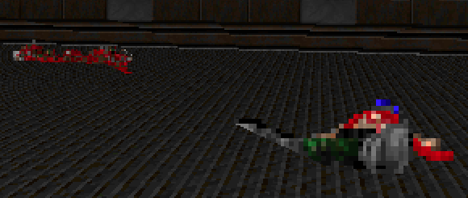
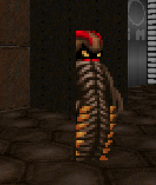
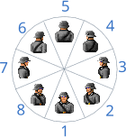
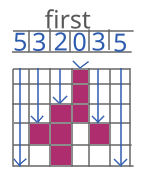

# **Capítulo 10**. Thing. Wall Sprite y Face Sprite
> *Código fuente*: [Source](./src) 

Para darle vida a un videojuego no nos alcanza con paredes y superficies. Necesitamos enemigos, objetos, power-ups y decoración que enriquecen la escena. Vamos a poder representar estos elementos en el engine mediante **Things**.\
El siguiente fragmento introduce la taxonomía de Things
```
Thing
|_ Voxel
|_ Sprite
   |_ Flat Sprite
   |_ Segment Sprite
      |_ Face Sprite
      |_ Wall Sprite
 ```
 Los primeros dos grupos en los que se subdivide son los **Sprites** y los **Voxels**. Los primeros son imágenes 2D que son proyectadas en pantalla de acuerdo a alguna perspectiva. Por otro lado, los Voxels son imágenes 3D que en vez de píxeles cuadrados contiene la información del color de cubos llamados *vóxeles*.\
A los Sprites podemos dividirlos según su proyección en **Segment Sprites** y en **Flat Sprites**. Los primeros basan su proyección en la existencia de un Segment (el mismo utilizado por las walls) y son ortogonales a los Flats. Por el contrario, los Flat Sprites son paralelos al suelo.\
Por último, los Segment Sprites pueden ser **Face Sprites** si siempre estan orientados hacia la cámara (ej.: los enemigos y objetos del Doom Engine) o pueden ser **Wall Sprites** si funcionan como las wall convencionales.\
Una cualidad interesante de las Things es que se tiene en cuenta el canal alpha de las texturas, permitiendo la existencia de superficies traslúcidas.


En este capítulo daremos una introducción a la implementación de las Things en código y dibujaremos los Segment Sprites. En los siguientes capítulos iremos completando la implementación de las otras clases.

## Face Sprite
### Diseño
Complementario al archivo del nivel, crearemos un nuevo archivo que defina propiedades de una clase de una Thing. Luego en el archivo de nivel, se especifica dónde se crea una instancia de esa Thing y sus parámetros inciales.

En ResourceManager creamos una variable que almacene la definición de las Things, junto con una función que permita crearlas.
```javascript
const ResourceManager = {
    levels: {},
    things: {},
    . . .
    loadThings(...things) {
        for (const thing of things)
            this.things[thing.name] = thing
        Linker.linkThings(this.things)
    }
}
```

Esto nos permite crear un archivo de definición de Things (`things.js`) que invoca a esta función del ResourceManager:
```javascript
ResourceManager.loadThings(
    {
        name: "statue",
        texture: "statue"
    },

    {
        name: "alga",
        texture: "alga",
        type: "wall"
    }
)
```
En el fragmento definimos dos Things: un Face Sprite llamado "statue" y un Wall Sprite llamado "alga". Distinguimos el tipo de Thing mediante el parámetro "type".

```javascript
const Linker = {
   . . .
    linkThings(things) {
        for (const name in things) {
            const thing = things[name]
            thing.texture = {name: thing.texture}
            this.linkThingTexture(thing.texture)
        }
    },

    linkThingTexture(texture) {
        TextureLoader.getTexture(texture.name, info => {
            texture.data = info.data
            texture.h    = info.h
            texture.w    = info.w
        })
    }
}
```

En el diseño del nivel debemos especificar dónde se ubican las instancias de los Sprites dentro de un sector. El siguiente fragmento en toml muestra cómo se indica:
```toml
[[sectors]]
    name = "main"

    . . .

    [[sectors.things]]
    thing = "statue"
    x = 18
    y = 5
    z = 1
    h = 2
    w = 2

    [[sectors.things]]
    thing = "statue"
    x = 22
    y = 8
    z = 1
    h = 2
    w = 2

```

En Sector necesitamos una variable auxiliar que almacene las Things presentes en el mismo, de igual forma a cómo se almacenan los Segments:


```javascript
const Sector = (name) => ({
    . . .
    visibles: [],
    things: [],
    . . .
})
```

### Estructura

Como mencionamos anteriormente, los Wall Sprites y los Face Sprites se agrupan en los Segment Sprites, puesto que comparten ciertas características de proyección. Es lógico, entonces, pensar que pueden heredar de una clase común. Creamos a `SegmentSprite`:

```javascript
const SegmentSprite = {
    project() {
    },

    draw(viewport) {
    }
}
```

Luego, creamos a `FaceSprite` y hacemos que herede de SegmentSprite:
```javascript
const FaceSprite = () => ({
    pos: v3(),
    h: 1, w: 1, // Dimensiones en unidades

    init() {
        this.super = {
            draw: this.__proto__.draw.bind(this),
            project: this.__proto__.project.bind(this)
        }
    },

    project() {
        return this.super.project()
    },

    draw(viewport) {
        this.super.draw(viewport)
    },

    __proto__: SegmentSprite
})
```
Note que en el anterior almacenamos las funciones de la Super Clase en una variable interna, y le anexionamos el campo "this" con el `bind`.

### Parser y Linker
En el Parser:
```javascript
const Parser = {
    . . .
    parseSector(name, info) {
        . . .
        if (info.things)
            for (const thing of info.things)
                sector.things.push(this.parseThing(thing))

        return sector
    },

    . . .

    parseThing(info) {
        const definition = ResourceManager.things[info.thing]
        let thing = FaceSprite()
        thing.thing = definition
        thing.pos.x = info.x
        thing.pos.y = info.y
        thing.pos.z = info.z
        thing.h = info.h || 1
        thing.w = info.w || 1

        thing.init()

        return thing
    }
}
```

### Renderización
La renderización de las Things ocurre luego de haber dibujado las paredes y superficies del nivel. Para evitar errores visuales vamos a dibujarlas sobre una columna auxiliar del Renderer: el `front`. Luego cuando se quiera transferir esta columna al mapa de píxeles, debemos tener en cuenta el efecto de la transparencia.
```javascript
const Renderer = {
    . . .
    init(canvas) {
        . . .
        // Pixel Data
        . . .
        this.column = new Uint8Array(this.height * 4).fill(255)
        this.front  = new Uint8Array(this.height * 4).fill(0)
        . . .
    },

    draw() {
        . . .
        while (this.MainViewport.x < this.width) {
            this.column.fill(255)
            this.front.fill(0)
            . . .
        }
        . . .
    },

    drawColumn(col) {
        let i = col << 2
        for (let y = 0; y < this.column.length; y+=4) {
            const alpha = this.front[y + 3] / 255,
                  beta = 1 - alpha
            this.pixels[i]   = beta * this.column[y]   + alpha * this.front[y]
            this.pixels[i+1] = beta * this.column[y+1] + alpha * this.front[y+1]
            this.pixels[i+2] = beta * this.column[y+2] + alpha * this.front[y+2]
            i += this.width << 2
        }
    },
    . . .
}
```

#### Proyección
Como mencionamos anteriorment, los Segment Sprite basan su proyección en un Segment. Debemos asignarlo al momento de inicializar el Face Sprite. Por definición, el Face Sprite siempre está orientado hacia la cámara. Debemos, entonces, transformar la función de proyección del Segment del Sprite:

```javascript
const FaceSprite = () => ({
    . . .
    init() {
        const s = Segment(this.pos.x, this.pos.y, 0, 0)
        s.toCameraSpace = () => {
            s.p0.toCameraSpace()
            const off = this.w * .5 * Camera.FOVRelation
            s.p1.xp = s.p0.xp + off
            s.p1.yp = s.p0.yp
            s.p0.xp -= off
        }
        this.segment = s
        . . .
    },
    . . .
})
```
Recordemos que las coordenadas `xp` e `yp` pertenecen al Camera Space. Si aplicamos un offset en el eje xp para ambos extremos del segment, estamos transformándolo para que sea paralelo al plano de proyección.

Ahora podemos completar la proyección del 
```javascript
const SegmentSprite = {
    clipping() {
        this.u0 = this.segment.p0.l * this.texture.w
        this.u1 = this.segment.p1.l * this.texture.w
    },

    project() {
        if (!this.segment.toDepthSpace(true)) return false
        this.segment.toScreenSpace(this.pos.z + this.h * .5, this.pos.z - this.h * .5)
        this.clipping()
        return true
    },
    . . .
}
```
En el llamado a `toDepthSpace`, el Segment va a invocar a su función modificada de `toCameraSpace` que definimos anteriormente. Luego llamamos a la función clipping que es similar a la de Wall.

Como las Things tienen canal alpha en la textura se deben dibujar desde atrás hacia adelanta, a diferencia de las Walls. Es por ello que surge la necesidad de saber qué Segment Sprite está delante de otro. La siguiente función retorna true si "this" se debe dibujar antes que "thing".
```javascript
const SegmentSprite = {
    . . .
    drawBefore(thing) {
        const s0 = this.segment.p0.col, s1 = this.segment.p1.col,
            t0 = thing.segment.p0.col, t1 = thing.segment.p1.col
        if (s0 > t1 || t0 > s1) return true // No hay superposición
        const col = Math.max(0, s0, t0)
        return thing.segment.getDepthAt(col) > this.segment.getDepthAt(col)
    },
    . . .
}
```

Dentro de Sector llamamos a la proyección de cada Thing. Aquellos que sean visibles los almacenamos en un vector llamado visibleThings. Luego, lo ordenamos siguiendo el algoritmo de [Insertion Sort](https://www.geeksforgeeks.org/insertion-sort/) empleando la función *drawBefore* para la comparación.
```javascript
const Sector = (name) => ({
    . . .
    things: [],
    visibleThings: [],

    project() {
        . . .
        this.visibleThings.length = 0 // Limpio el arreglo auxiliar
        for (const thing of this.things)
            if(thing.project())
                this.visibleThings[this.visibleThings.length] = thing

        this.sortThings()
    },

    sortThings() {
        const A = this.visibleThings
        for (let i = 1; i < A.length; i++) {
            let j = i
            while (j > 0 && A[j].drawBefore(A[j-1])) {
                // Swap
                const temp = A[j]
                A[j] = A[j-1]
                A[j-1] = temp
                j--
            }
        }
    }
})
```


#### Dibujo
Luego de proyectar los Sprites, solo quedan dibujarlos. La función es similar a la vista en las Walls, con la diferencia de que tiene en cuenta el canal alpha. Adicionalmente, el Sprite debe verificar si es visible o si existe una Wall que lo obstruye. Es por ello que consulta el buffer *depth* del Viewport.

        
```javascript
const FaceSprite = () => ({
    . . .
    draw(viewport) {
                const s = this.segment,
              texture = this.texture

        // Verifica que la columna está dentro del área del Sprite (similar a Ray Casting)
        if (s.p0.col > viewport.x || s.p1.col < viewport.x) return

        const depth = s.p0.depth

        if (depth < viewport.depth[viewport.x]) return // Si hay una Wall delante

        const dx = (viewport.x - s.p0.col) / (s.p1.col - s.p0.col)
        const top =    s.p0.top    + (s.p1.top    - s.p0.top)    * dx
        const bottom = s.p0.bottom + (s.p1.bottom - s.p0.bottom) * dx
        if (bottom < viewport.top) return

        const u = (this.u0  + (this.u1 - this.u0) * dx) & (texture.w - 1)

        this.super.draw(u, top, bottom, viewport)

    },
    . . .
})

```
```javascript
const SegmentSprite = {
    . . .
    // Función compartida entre Face Sprite y Wall Sprite
    draw(u, top, bottom, viewport) {
        const texture = this.texture
        const dv = texture.h / (bottom - top)

        const b = Math.min(bottom, viewport.bottom) * 4
        let y = Math.max(~~top, viewport.top)

        if (b < 0 || y > Renderer.height) return

        let v = (y - top) * dv
        const i0 = u * texture.h

        for (y *= 4; y < b; y+=4, v+=dv) {
            const i = (i0 + (v & (texture.h - 1))) << 2
            const alpha = texture.data[i + 3] / 255,
                  beta = 1 - alpha

            Renderer.front[y]   = beta * Renderer.front[y]   + alpha * texture.data[i]
            Renderer.front[y+1] = beta * Renderer.front[y+1] + alpha * texture.data[i+1]
            Renderer.front[y+2] = beta * Renderer.front[y+2] + alpha * texture.data[i+2]
            Renderer.front[y+3] = beta * Renderer.front[y+3] + alpha * texture.data[i+3]
        }
    }
}
```

Por último, invocamos esta función en Viewport:

```javascript
const Viewport = (width) => ({
    . . .
    draw() {
        . . .
        for (const thing of this.sector.visibleThings)
            thing.draw(this)
    }
})
```
### Solución de errores
Aunque la implementación anterior parece correcta, existen dos errores visuales causados cuando el Segment proyectado del Sprite atraviesa un portal

**Clipping incorrecto por el Viewport Bottom**



Ocurre cuando un Portal conduce a un sector cuya altura del suelo es mayor o igual a la actual y hay un Sprite cerca del límite. El Bottom del Viewport recorta el Sprite el cual debería dibujar la columna completa. La solución consiste en identificar si hay un Step Up, si la Cámara está por encima del Next Floor Z y si el Portal es el que impone el Bottom así lo podemos ignorar.\
En Portal:
```javascript
const Portal = () => ({
    . . .    
    draw(viewport) {
        const bottomZ = this.segment.bottomZ
        const topZ    = this.segment.topZ
        this.hasStepUp = this.next.floor.z >= bottomZ && Camera.pos.z > this.next.floor.z
        . . .
    },
    . . .
})
```
En SegmentSprite:
```javascript
const SegmentSprite = {
    . . .
    draw(u, top, bottom, viewport) {
        const texture = this.texture
        const dv = texture.h / (bottom - top)

        let clippingBottom = viewport.bottom
        if (viewport.segment && ~~viewport.segment.getBottomAt(viewport.x) === viewport.bottom) {
            // El Portal impone el bottom
            if (viewport.segment.wall.hasStepUp)
                clippingBottom = Renderer.height
        }
        const b = Math.min(bottom, clippingBottom) * 4
        . . .
    }
}
```


**Clipping Incorrecto por Depth**



Ocurre cuando un Sprite está muy cerca de un Portal de su mismo sector. Al proyectar el segment en el Depth Space, atraviesa al Portal, lo que ocasiona que parte del mismo quede detrás del Wall y se evite la renderización. La solución consiste en verificar que si atraviesa un Portal, debemos tener en cuenta el Depth Buffer de su viewport.

En FaceSprite:
```javascript
const FaceSprite = () => ({
    . . .
    draw(viewport) {
        . . .
        const depth = s.p0.depth

        if (depth < viewport.depth[viewport.x] && ( // Si estoy detrás de un Segmento
            !viewport.closest[viewport.x].wall.isPortal || // Si es una Solid Wall => return
            depth < viewport.closest[viewport.x].wall.viewport.depth[viewport.x] // Si es un Portal vuelvo a verificar teniendo en cuenta su Viewport
        ))
            return
        . . .
    },
    . . .
})
```
## Directional Face Sprite
Como puede observarse, no importa desde qué ángulo se observa el Sprite, siempre se va a dibujar la misma cara orientada hacia la cámara. En la mayoría de casos, es un efecto deseable ya que con solo una textura se simula el objeto. Por otro lado, cuando se tienen enemigos o personajes, es necesario identificar en qué ángulo están orientados para poder identificar si está de espaldas o si el jugador se encuentra en su rango de visión.

Como estamos desarrollando un motor gráfico 2D no podemos renderizar un cuerpo 3D orientado. La solución consiste en dibujar los Sprites con diferente textura dependiendo del ángulo en que se lo mire.

Tanto el Doom Engine como el Build Engine tienen una convención de emplear 8 direcciones posibles como muestra la siguiente figura:



### Diseño
Un Directional Sprite se define indicando el campo "directional" en true:
```javascript
ResourceManager.loadThings(
    . . .
    {
        name: "soldier",
        texture: "idle",
        directional: true
    }
)
```
Como mencionamos, requerimos 8 texturas distintas, una para cada ángulo, pero en el diseño solo llamamos a una textura. Esto es debido a que el nombre que se indica en el campo "texture" (idle) hace referencia a la familia de texturas: idle1..idle8. Entonces para saber cuál debemos dibujar, seleccionamos la textura: this.texture + this.orientation

Luego en el diseño del nivel, instanciamos el Sprite como los demás y podemos indicar su ángulo de orientación mediante el campo "angle". Recordemos que en el diseño los ángulos se indican en grados y no en radianes:
```toml
[[sectors]]
    name = "main"

    . . .
    [[sectors.things]]
    thing = "soldier"
    x = 20
    y = 6
    z = 1
    h = 2
    w = 2
    angle = 90
```

Actualizamos el Parser permitiendo cargar el ángulo si es Directional:
```javascript
const Parser = {
    . . .
    parseThing(info) {
        const definition = ResourceManager.things[info.thing]
        let thing = FaceSprite()
        if (definition.directional)
            thing.angle = (info.angle || 0) * Math.PI / 180
        . . .
    }
}
```

Luego, actualizamos el Linker para cargar las 8 texturas correspondientes si se trata de un Directional:
```javascript
const Linker = {
    . . .
    linkThings(things) {
        for (const name in things) {
            const thing = things[name]
            if (thing.directional) {
                thing.textures = new Array(8).fill(0).map((_, i) => ({name: thing.texture + (i+1)}))
                thing.textures.forEach(this.linkThingTexture)
            } else {
                thing.texture = {name: thing.texture}
                this.linkThingTexture(thing.texture)
            }
        }
    },

    linkThing(thing) {
        if (thing.thing.directional) { // Actualizamos las referencias e indicamos la textura inicial
            thing.textures = thing.thing.textures
            thing.texture = thing.textures[0]
        } else
            thing.texture = thing.thing.texture
    }
}
```

### Proyección
Una vez tenemos la información cargada en el Sprite queda elegir qué textura debe dibujarse en cada momento. Para ello debemos obtener el ángulo entre la posición relativa de la Cámara respecto a la posición del Sprite y la dirección a la que está mirando. El ángulo se obtiene mediante la función [atan2](https://developer.mozilla.org/en-US/docs/Web/JavaScript/Reference/Global_Objects/Math/atan2) a la que debemos proporcionarle las coordenadas de nuestra posición relativa: `a = atan2(dy, dx)`.\
Luego le sumamos el ángulo del Sprite para tener en cuenta su orientación: `a = atan2(dy, dx) + angle`.\
Si nos fijamos en la figura previa de la orientación, vemos que en realidad la textura 1 debe ser visible para el rango de ángulo [-22.5°, 22.5°] o en radianes [-PI/8, PI/8]. Entonces debemos considerar este desfasaje: `a = atan2(dy, dx) + angle - PI/8`.\
Esta ecuación puede darnos valores mayores a 2PI, a nosotros nos interesa tener valores entre 0 y 2PI: `a = (atan2(dy, dx) + angle - PI/8) % 2PI`.\
Por último, hay que considerar que la ecuación puede dar ángulos negativos. Una solución simple, es aprovechar el módulo y sumar una cantidad determinada de 2PI: `a = (X * PI + atan2(dy, dx) + angle - PI/8) % 2PI`.\
Si a este ángulo lo dividimos por PI/4 entonces obtendremos un número de 0..7 que lo podemos usar como índice para indicar la textura a utilizar.

El cálculo de este ángulo lo debemos realizar en la proyección del Sprite:
```javascript
const FaceSprite = () => ({
    . . .
    project() {
        if (this.super.project()) {
            if (this.thing.directional) {
                const dx = Camera.pos.x - this.pos.x
                const dy = Camera.pos.y - this.pos.y
                const angle = (20 * Math.PI + Math.atan2(dy, dx) + this.angle - Math.PI * .125) % (2 * Math.PI)
                this.texture = this.textures[7 - ~~(4 * angle / Math.PI)]
            }
            return true
        }
        return false
    },
    . . .
})

```
### Dibujo
La renderización no sufre cambios con respecto al Face Sprite convencional.

## Sprite Wall
Si queremos diseñar ventanas o decoraciones en las paredes, necesitamos que la textura tenga perspectiva de Wall. Para conseguirlo, necesitamos un nuevo tipo de Sprite: el Wall Sprite.
### Diseño
Indicamos que queremos que la Thing sea un Wall Sprite por medio del campo "type" con valor "wall". Este campo lo vamos a utilizar más adelante para indicar los demás tipos de Thing.
```javascript
ResourceManager.loadThings(
    . . .
    {
        name: "alga",
        texture: "alga",
        type: "wall"
    }
)
```

### Estructura
Creamos el archivo `WallSprite` con la definición:
```javascript
const WallSprite = () => ({
    isWall: true, // Para distinguir el tipo de Thing
    pos: v3(),
    angle: 0,
    h: 1, w: 1, // Dimensiones en unidades

    init() {
        const s = Segment(0,0,0,0)
        this.setAngle = angle => {
            this.angle = angle
            const cos = Math.cos(angle) * this.w * .5,
                sin = Math.sin(angle) * this.w * .5
            s.p0.x = this.pos.x + sin
            s.p0.y = this.pos.y - cos
            s.p1.x = this.pos.x - sin
            s.p1.y = this.pos.y + cos
        }
        this.segment = s
        this.setAngle(this.angle)
        this.super = {
            project: this.__proto__.project.bind(this),
            draw: this.__proto__.draw.bind(this)
        }
    },

    project() {
        return this.super.project()
    },

    draw(viewport) {
        // Cálculo U, Top y Bottom
        this.super.draw(u, top, bottom, viewport)
    },

    __proto__: SegmentSprite
})
```
El Wall Sprite tiene un ángulo de orientación, lo que quiere decir que los extremos del Segment están definidos por el ángulo y por el ancho del Sprite.

En el nivel creamos un Wall Sprite y podemos indicar su ángulo y si es **Double Sided**. Esta propiedad indica si debemos dibujar el Sprite cuando estamos viéndolo de atrás.
```toml
[[sectors]]
    name = "main"

    . . .
    [[sectors.things]]
    thing = "alga"
    x = 16.5
    y = 2
    z = 1
    h = 2
    w = 7
    angle = -90
    doubleSide = true
```

En Parser instanciamos de acuerdo al tipo de Thing:
```javascript
const Parser = {
    . . .
    parseThing(info) {
        const definition = ResourceManager.things[info.thing]
        let thing
        switch(definition.type) {
            case "wall":
                thing = WallSprite()
                thing.angle = (info.angle || 0) * Math.PI / 180
                thing.doubleSide = !!info.doubleSide
                break
            default:
                thing = FaceSprite()
                if (definition.directional)
                    thing.angle = (info.angle || 0) * Math.PI / 180
                break
        }
        . . .
    }
}
```

### Proyección
En la proyección tenemos que tener en cuenta si el Sprite es Double Sided y estamos viéndolo desde atrás (p0.col > p1.col). Si ese es el caso debemos invertir los extremos p0 <--> p1. Posteriormente se debe tener consideración en el mapeo de U e invertirlo en caso de estar viendo el lado de atrás.
```javascript
const WallSprite = () => ({
    . . .
    project() {
        if (this.super.project()) {
            if (this.doubleSide) {
                if (this.segment.p0.col > this.segment.p1.col) {
                    let tmp = this.segment.p0
                    this.segment.p0 = this.segment.p1
                    this.segment.p1 = tmp
                    this.inv = !this.inv
                }
                // Debemos invertir los valores de U en los extremos para garantizar el mapeo correcto de la textura
                if (this.inv) {
                    this.u0 *= -1
                    this.u1 *= -1
                }
            }
            return true
        }
        return false
    },
    . . . 
})
```
### Dibujo
El dibujo es muy similar a lo de una Wall convencional. Se tiene en cuenta el campo depth en ambos extremos del Segment para garantizar el Mapeo con corrección de perspectiva.
```javascript
const WallSprite = () => ({
    . . .
    draw(viewport) {
        const s = this.segment,
              texture = this.texture
        if (s.p0.col > viewport.x || s.p1.col < viewport.x) return

        const dx = (viewport.x - s.p0.col) / (s.p1.col - s.p0.col)
        const depth  = s.p0.depth  + (s.p1.depth  - s.p0.depth)  * dx

        if (depth + 0.001 < viewport.depth[viewport.x]) return // Si hay una Wall delante

        const top =    s.p0.top    + (s.p1.top    - s.p0.top)    * dx
        const bottom = s.p0.bottom + (s.p1.bottom - s.p0.bottom) * dx
        if (bottom < viewport.top) return
        const uinv = this.u0 * s.p0.depth + (this.u1 * s.p1.depth - this.u0 * s.p0.depth) * dx

        const u = (uinv / depth) & (texture.w - 1)
        this.super.draw(u, top, bottom, viewport)
    },
    . . .
})
```
## Optimización
En muchos casos la implementación actual es suficiente, pero si tiene planeado dibujar varios Sprites en pantalla, no es la más óptima. Analizaremos dos problemas y sus respectivas soluciones.
### Buckets
Traigamos el siguiente código del `Viewport`:

```javascript
const Viewport = (width) => ({
    . . .
    draw() {
        . . .
        for (const thing of this.sector.visibleThings)
            thing.draw(this)
    }
})
```

Por cada columna estamos iterando sobre todo el arreglo `visibleThings` del Sector y enviando a dibujar. Luego dentro del Sprite determinamos si se encuentra en esa columna o no: `if (s.p0.col > viewport.x || s.p1.col < viewport.x) return`. Como puede verse, esto es un desperdicio de tiempo.\
Una solución es dividir la pantalla en X partes de Y píxeles e indicar qué Things son visibles en cada una de ellas.  De esta forma, el Viewport solo debe iterar en una porción donde es altamente probable encontrar una Thing.\
**Nota:** Si Y es una potencia de 2 entonces podemos evitar dividir y reemplazarlo por un *Right Shift*.\
Al contenedor de las Things en una parte de la pantalla lo llamamos **bucket** y están presentes en cada Viewport:
```javascript
const Viewport = (width) => ({
    . . .
    buckets: new Array(Renderer.width / 16).fill(0).map(() => []), // Viewport tiene 20 partes de 16px cada una: 20x16=320

    clear() {
        . . .
        for (const bucket of this.buckets)
            bucket.length = 0
    },

    loadBuffers() {
        . . .
        for (const t of this.sector.visibleThings) {
            // Si está fuera de los límites del boundary
            if (this.segment && t.segment.p0.depth > Math.max(this.segment.p0.depth, this.segment.p1.depth)) continue
            let from = Math.max(t.segment.p0.col >> 4, 0) // floor(col / 16)
            const to = Math.min(t.segment.p1.col >> 4, this.buckets.length - 1)
            for (; from <= to; from++)
                this.buckets[from].push(t)
        }
    },
    . . .
    draw() {
        . . .
        const bucket = this.buckets[this.x >> 4]
        for (const thing of bucket)
            thing.draw(this)
    }
})
```
En la función `loadBuffers` indicamos qué Things son visibles dentro de cada parte de la pantalla.

Luego en el draw enviamos a dibujar cada Thing luego de dibujar las superificies.
### First
Si observa con atención las texturas empleadas en los Sprites, va a encontar demasiados espacios vacíos (transparentes), incluso columnas enteras que no poseen un único píxel de color. Si lo pensamos bien, es un gasto innecesario de procesamiento iterar por todas esas áreas vacías.\
Una solución simple es tener un arreglo auxiliar **first** que nos indique cuál es el primer píxel de color en una columna (aquel cuyo alpha>0). La siguiente figura muestra cómo funcionaría dicho arreglo:



Este arreglo debe almacenarse junto con la información de la textura. Entonces, en el Linker:
```javascript
const Linker = {
   . . .
    linkThingTexture(texture) {
        TextureLoader.getTexture(texture.name, info => {
            . . .
            // Completa el arreglo que indica el primer píxel no transparente
            texture.first = new Uint8Array(texture.w)
            for (let x = 0; x < info.w; x++) {
                let y = 0
                //                                       Componente alfa de la textura
                //                                                    V
                while (y < info.h && info.data[(x * info.h + y) * 4 + 3] === 0)
                    y++

                texture.first[x] = y
            }
        })
    }
}
```
Lo que queda es modificar la renderización del Segment Sprite. Cuando estemos por elegir el valor de Y desde el que se comienza a dibujar, debemos calcular el offset causado por first para la componente U que se está dibujando:
```javascript
const SegmentSprite = {
    . . .
    draw(u, top, bottom, viewport) {
        const texture = this.texture
        const dv = texture.h / (bottom - top)

        const b = Math.min(bottom, viewport.bottom) * 4
        let y = Math.max(~~(top + texture.first[u] / dv), viewport.top)
        . . .
    }
}
```
## Conclusión
Con la introducción de los Sprites en nuestro Engine podemos dotar de vida nuestras escenas. De esta forma, somos capaces de replicar visualmente al Doom Engine. Adicionalmente, vimos un par de técnicas para optimizar el código, lo que en el Software Rendering siempre es deseable disminuir el cómputo.

En los próximos capítulos nos quedan ver las otras dos clases de Things: los *Flat Sprites* y los *Voxels*.

### Yapa
Ahora nuestro FreeDoom en JavaScript puede renderizar los Sprites :D. Disponible en: [FreeDoom-JS-v2](./freedoom-js-v2/index.html)