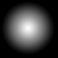

# **Capítulo 14**. Particle System
> *Código fuente*: [Source](./src)

Cambios en Viewport para poner el Emitter en un bucket


Con el conjunto de elementos renderizables que poseemos, aun hay objetos y fenómenos que son difíciles de representar. Estos son principalmente objetos amorfos que se transforman con el tiempo que comunmente se los relacionan a fluidos. Hablamos de humo, fuego, chispas, líquidos que se mueven, etc. Estos efectos visuales comunmente se consiguen mediante un **Sistema de Partículas** (*Particle System*).

Fundamentalmente, el Particle System se va a encargar de administrar gran cantidad de partículas en escena. Estas van a tener una textura determinada que siempre va a estar orientada hacia la cámara, lo que se conoce como *billboard*. Las partículas se van a mover en distintas direcciones y velocidades dependiendo del efecto que se desea simular. Habitualmente, la partícula tiene un tiempo de vida finito y durante su recorrido, su *lifetime*, irá sufriendo cambios en su dirección, color, tamaño, etc.

Al objeto encargado de emitir estas partículas lo denominamos **Emitter**. Cada Emitter tiene propiedades que definen un efecto de partículas.

El Particle System es el objeto encargado de administrar todos los emitter activos en diversos Sectores.

Los archivos relacionados con este capítulo se agrupan en la carpeta "/particles":
- `particles/Emitter.js`: Define la estructura de datos de un Emitter
- `particles/ParticleSystem.js`: Administrador de todos los Emitters activos
- `particles/Shapes.js`: Funciones adicionales que ayudan a darle forma al Emitter
- `particles/utils.js`:  Definiciones que ayudan en la creación del Emitter, aunque también son útiles en otros campos


## Introducción

A diferencia de cómo fueron creados los objetos en los anteriores capítulos, el Emitter necesita un texto que represente su código, el cual se "compila" en tiempo de inicialización con el objetivo de mejorar el performance. Uno de los objetivos a consegir es la versatilidad del Particle System, es decir, que el diseñador sea capaz de configurar gran cantidad de aspectos del sistema para representar de mejor forma el efecto deseado.

Sistemas de Partículas existen tantos como Graphics Engines, pero el que se va desarrollar está fuertemente basado en el de Unity cuya documentación se encuentra en [Unity Particle System](https://docs.unity3d.com/Manual/Built-inParticleSystem.html) y su [API](https://docs.unity3d.com/ScriptReference/ParticleSystem.html).

La primera versión del Sistema se hizo acorde a lo planteado en el tutorial de [BuildNewGames](http://buildnewgames.com/particle-systems/). Se puede notar que si el sistema posee varios módulos que el usuario puede activar o desactivar, se genera gran cantidad de código condicional para hacer la solución lo más genérica posible. Una forma de evitar la gran cantidad de condicionales, y de tamaño de código, es ensamblar código y convertirlo en función constructora.

## Texture

Por lo general, las partículas carecen de color, siendo un imagen en escala de grises:



Sobre esta textura, se aplica un color distinto para cada partícula.

Para su renderización, se emplea un **alpha blending** que define cómo el color de la textura altera los gráficos de fondo para lograr efectos de semitransparencia. La fórmula consiste en:

```javascript
const alpha = data[i + 3] / 255,
    beta = 1 - alpha * particle.blend
```

Donde `particle.blend` es un valor entre 0 y 1 que define cómo se comporta el blending.

## Emitter

El Objeto Emitter, nos permite crear *Funciones Constructoras* de Emitters a partir de ensamblar código. Un emitter se instancia a partir de la Función Constructora y luego se coloca dentro de un sector, desde el cual es considerado como un *Thing*.

```javascript
const Emitter = {
    parse(info) {
        return new Function(`const _new = {
            isEmitter: true, // Lo distingue de otras Things
            active: true,

            particles: [],  // Todas las partículas cargadas estáticamente
            length: 0,      // Cuántas partículas están activas en este momento

            /**
             * Inicializa un nueva partícula, si queda alguna libre
             * */
            addParticle() {
                if (this.length >= this.particles.length)
                    return false

                this.initParticle(this.particles[this.length++])
                return true
            },

            /**
             * "Elimina" la partícula ubicada en la posición "index" dentro del arreglo de partículas
             * */
            removeParticle(index) {
                const tmp = this.particles[--this.length]
                this.particles[this.length] = this.particles[index]
                this.particles[index] = tmp
            },

            /**
             * initParticle(particle):
             * asigna las propiedades iniciales de la partícula
             * */
            ${this.parseInitParticle(info)},

            /**
             * updateParticle(particle, deltaTime):
             * actualiza las propiedades de la partícula,
             * tales como la velocidad, posición, color, etc.
             * */
            ${this.parseUpdateParticle(info)},

            /**
             * update(deltaTime):
             * actualiza las propiedades del Emitter
             * luego actualiza todas las partículas
             * */
            ${this.parseUpdate(info)},
            
            // Hereda del Template definido en Emitter
            __proto__: Emitter.Template
        }
        return _new`)
    },

    // Estas funciones ensamblan el código de acuerdo a las propiedades de definición (info)
    parseInitParticle(info) { ... },
    parseUpdateParticle(info) { ... },
    parseUpdate(info) { ... },

    // Objeto que define el comportamiento común entre todos los emitters
    Template: {
        project() { ... },          // Proyecta todas las partículas
        sort() { ... },             // Ordena las partículas dentro del emitter
        drawBefore(thing) { ... },  // Si se debe dibujar antes que el Thing dentro de un sector
        draw(viewport) { ... }      // Envía a dibujar al emitter en pantalla
    }
}
```

Como se puede notar en el fragmento anterior, el código se ensambla de acuerdo a lo especificado dentro del objeto "info" pasado como argumento en la función `parse`. A este objeto se lo denomina **Objeto Definición** y su especificación de contenido se encuentra detallada en la sección  [Especificación](#especificación).

## Particle System

Como mencionamos, el Particle System es un objeto administrador de todos los Emitters activos. Adicionalmente, mantiene las definiciones de los Emitters (Objetos Definición).

```javascript
const ParticleSystem = {
    activeEmitters: [],     // Emitters activos en el momento
    emitters: {},           // Objetos Definición, indexados por nombre de Efecto

    /**
     * Carga las definiciones presentes en el objeto enviado como argumento "emitters"
     * */
    load(emitters) {
        for (const name in emitters)
            this.emitters[name] = Emitter.parse(emitters[name])
    },

    /**
     * Actualiza todos los Emittes activos hasta el momento.
     * Si el flag "active" de Emitter está en false, se elimina del sector en el que se encuentra
     * */
    update(dt) {
        for (let i = 0; i < this.activeEmitters.length; i++) {
            const emitter = this.activeEmitters[i]
            emitter.update(dt)
            if (!emitter.active) {
                emitter.sector.things = emitter.sector.things.filter(x => x !== emitter)
                this.activeEmitters[i] = this.activeEmitters[this.activeEmitters.length - 1]
                this.activeEmitters.length--
            }
        }
    },

    /**
     * Agrega el emitter al sector y a los activos
     * */
    addEmitter(emitter, sector) {
        emitter.sector = sector
        sector.things.push(emitter)
        this.activeEmitters.push(emitter)
    }
}
```

### Inicialización

Una vez creada la Función Constructora, es posible instanciar y configurar un Emitter de la siguiente forma:

```javascript
const emitter = ParticleSystem.emitters.fireworks()
emitter.pos.x = 9
emitter.pos.y = 3.5
emitter.pos.z = 0
emitter.duration = 10
emitter.loop = true
ParticleSystem.addEmitter(emitter, Player.sector)
```

### Things y Viewport

Para que un Emitter se integre de forma correcta con los demás Things dentro de un sector, debemos realizar algunos cambios en el `drawBefore` de `SegmentSprite.js`:

```javascript
const SegmentSprite = {
    . . .
    drawBefore(thing) {
        if (thing.isFlat || thing.isVoxel || thing.isEmitter) {
            . . .
        } else {
            . . .
        }
    },
    . . .
}
```

Y en `Rectangle.js`:

```javascript
const Rectangle = {
    . . .
    drawBefore(thing) {
        if (thing.isFlat || thing.isVoxel || thing.isEmitter) {
            . . .
        } else {
            . . .
        }
        return Math.abs(this.pos.z - Camera.pos.z) > Math.abs(thing.pos.z - Camera.pos.z)
    }
}
```

Adicionalmente, el Viewport debe saber cómo añadir los Emitters a sus buckets:

```javascript
const Viewport = (width) => ({
    . . .
    loadBuffers() {
        . . .
        for (const t of this.sector.visibleThings) {
            if (t.isFlat || t.isVoxel || t.isEmitter) {
                . . .
            } . . .
        }
    },
    . . .
})
```

### Especificación

Las propiedades definidas al inicio de cada partícula (lifetime, startSpeed, start...) se describen con curvas en función del tiempo normalizado t = elapsed / duration. Se dicen que son en función del tiempo de vida del emisor.

El módulo de **Noise** fue implementado siguiendo la serie de tutoriales [Noise](https://catlikecoding.com/unity/tutorials/noise/) y [Noise Derivative](https://catlikecoding.com/unity/tutorials/noise-derivatives/). El código del mismo puede encontrarse en [Noise.js](./src/Noise.js).

Algunos ejemplos de diseño de Emitters se puede encontrar en [emitters](./src/levels/emitters.js)

```
name: {
    lifetime:           Tiempo de vida de cada partícula en segundos
    gravityMultiplier:  Escala que se le aplica a la gravedad
    startSpeed:         Módulo de la velocidad inicial para cada partícula
    startColor:         Color inicial expresado como [r,g,b,a], donde cada uno es un valor entre 0 y 1
    startScale:         Tamaño inicial
    startRotation:      Define el ángulo incial
    totalParticles:     Cantidad total de partículas
    particleTexture:    Textura de la partícula

    emission: {         Módulo encargado de definir cómo ocurren las emisiones de partículas
        rate:           Velocidad a la que se emiten partículas
        bursts: [       Ráfagas de emisión
            {
                time:   Tiempo en segundos desde que inició el emitir a partir del cual empieza
                count:  Cantidad de partículas a emitir en esa ráfaga
                cycles: Cuántas veces se debe emitir
                interval:   Tiempo en segundo entre ciclos de emisión
            }
        ]
    }

    shape:              Define la posición y velocidad inicial para cada partícula. En el apartado Shapes se explican las disponibles

    forces: {            Módulo que indica cómo fuerzas aceleran la partícula
        linear:         En una dirección definida [x,y,z]
        radial:         Módulo. En dirección al centro del emisor
        tangencial:     Módulo. Perpendicular a la radial
        drag:           Resistencia al entorno. Aplica la fuerza: 0.5 * Drag * Tamaño * Velocidad^2
        multiplyDragByParticleSize:	    Ajusta la cantidad de drag dependiendo del tamaño
        multiplyDragByParticleVelocity: Ajusta la cantidad de drag dependiendo de la velocidad
    }

    velocity: {         Módulo que indica parámetros de la velocidad de la partículas a lo largo de su vida
        linear:         Indica cómo debe ser la velocidad [x,y,z]
        limit:          Límite de la velocidad
        dampen:         Fracción de la velocidad que se debe reducir, una vez supera el límite (1 reduce toda la velocidad)
        
    }

    color: {            Módulo que indica cómo varía el color de una partícula durante su vida
        byLife:         Define cómo es el color a lo largo de la vida. [r,g,b,a]
        bySpeed: {      Define cómo es el color dependiendo de la velocidad
            gradient:   Define el gradiente que se mapea entre el mínimo y el máximo de la velocidad [r,g,b,a]
            range:      Define el rango de velocidad sobre el que se mapea el gradiente. [min,max] Aquello que esté fuera del rango, se mapea a los límites.
        }        
    }

    size: {             Módulo que indica cómo varía el tamaño de una partícula durante su vida
        byLife:         Define cómo es el tamaño a lo largo de la vida
        bySpeed: {      Define cómo es el tamaño dependiendo de la velocidad
            size:       Define el tamaño que se mapea entre el mínimo y el máximo de la velocidad
            range:      Define el rango de velocidad sobre el que se mapea el tamaño. [min,max] Aquello que esté fuera del rango, se mapea a los límites.
        }        
    }

    rotation: {         Módulo que indica cómo varía la rotación de una partícula durante su vida
        byLife:         Define cómo es la rotación a lo largo de la vida
        bySpeed: {      Define cómo es la rotación dependiendo de la velocidad
            angle:      Define el ángulo que se mapea entre el mínimo y el máximo de la velocidad
            range:      Define el rango de velocidad sobre el que se mapea el ángulo. [min,max] 
        }
    }
    
    noise: {
        strength:       Cuánto afecta el Noise al movimiento de la partícula
        damping:        boolean. Si strength está modulada por la frecuencia
        frequency:      Frecuencia base
        octaves:        Capas de ruido que se suman
        lacunarity:     Factor por el que se multiplica la frecuencia de cada capa
        persistence:    Factor por el que se multiplica la amplitud de cada capa
        morphSpeed:     Velocidad a la que el Noise cambia con el tiempo
        method:         Método de Noise empleado. value2D, value3D, perlin2D, perlin3D...
    }

    collision: {        Determina cómo es la colisión con el ceiling o floor del Sector
        bounce:         Fracción de la velocidad que se mantiene luego de la colisión. 0: se detine
        lifeLoss:       Fracción de vida de la partícula que perdura, luego de la colisión. 0: muere
        maxSpeed:       Máxima velocidad permitida luego de la colisión. Si se supera, se elimina la partícula
        minSpeed:       Mínima velocidad permitida luego de la colisión. Si se supera, se elimina la partícula
        radiusScale:    Multiplicador que se aplica al tamaño de las partículas para verificar su colisión
    }

    subEmitters: [      Módulo que controla la generación de sub-emitters creados en la posición de las partículas, en instancias específicas de tu lifetime
        {
            stage:      Instancia en que ocurre la creacion: birth,death,collision
            subEmitter: Clase de Particle System que debe crearse
            duration:   Duración del sub-emitter en segundos
            loop:       Si debe hacerse en bucle
        }
    ]
}
```

### Shapes

Las Shapes definen la posición y velocidad inicial de las partículas.

#### Cone

Emite partículas desde la base o desde el interior del cono. Las partículas se desplazan desde el foco del cono. El cono es truncado, entonces tiene una base circular. La dirección general del cono está determinada por un vector unitario en coordenadas polares (phi, theta). `x=cos(phi)*cos(theta), y=cos(phi)*sin(theta), z=sin(phi)`

angle:      Ángulo de apertura del cono. Un ángulo de 0 es un cilindro, uno de 90° es un disco plano
radius:     Radio de la base
radiusThickness:    Proporción del volumen que emite partículas. Un valor de 0 emite partículas desde la superficie externa. Un valor de 1 emite partículas de todo el volumen disponible.
length:     Longitud del cono. Solo aplicable cuando: emitFromVolume=true
emitFromVolume:     Si es true, emite desde el volumen de la figura. Si es false, desde la base
phi, theta: Ángulos que definen la dirección del Cono

#### Box

Emite partículas desde los bordes, la superficie o el cuerpo de una caja. La partículas se mueven en la dirección especificada por las coordenadas polares (phi, theta).

emitFrom:   "Edge"/"Faces"/"Volume" Selecciona desde qué parte emitir
angle:      Ángulo de rotación de la caja en el eje Z
phi, theta: Ángulos que definen la dirección de las partículas
w, h, d:    Dimensiones de la caja

## Conclusión

Los Sistemas de Partículas son un tópico demasiado amplio que merecerían su propia serie de tutoriales. Pero con el fin de completitud de nuestro Graphics Engine, es necesario hacer una introducción a los mismos. Es muy probable que el lector encuentre mejoras formas de implementación, la presente en este capítulo es una mera aproximación.

El siguiente capítulo representa la cúlmine de nuestro camino por este Graphics Engine.